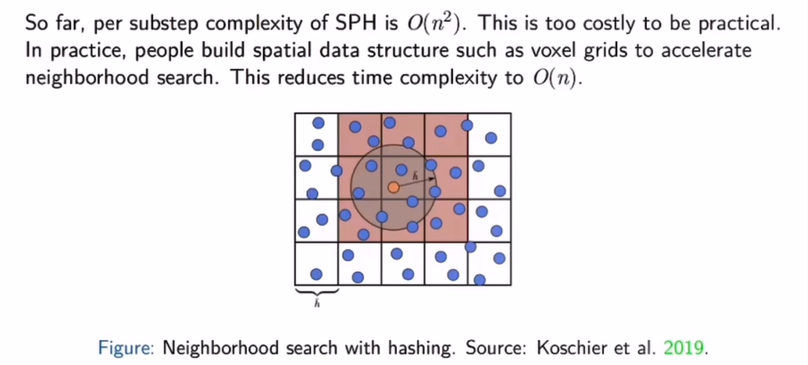
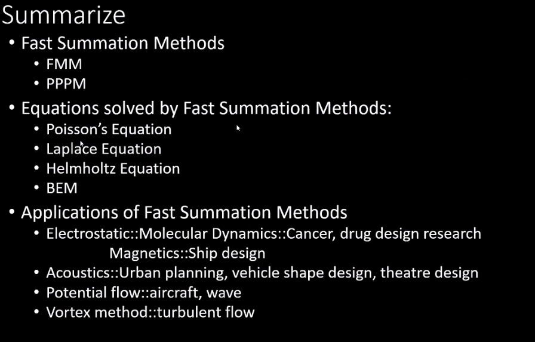
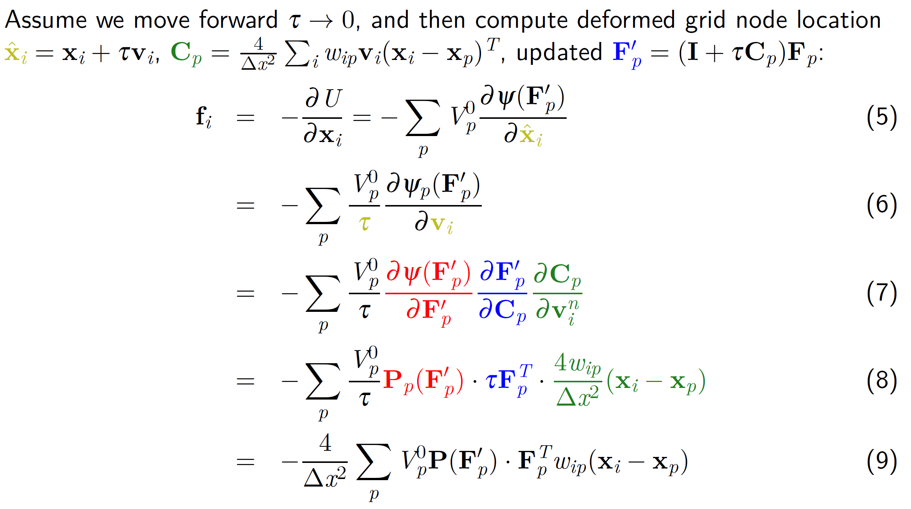
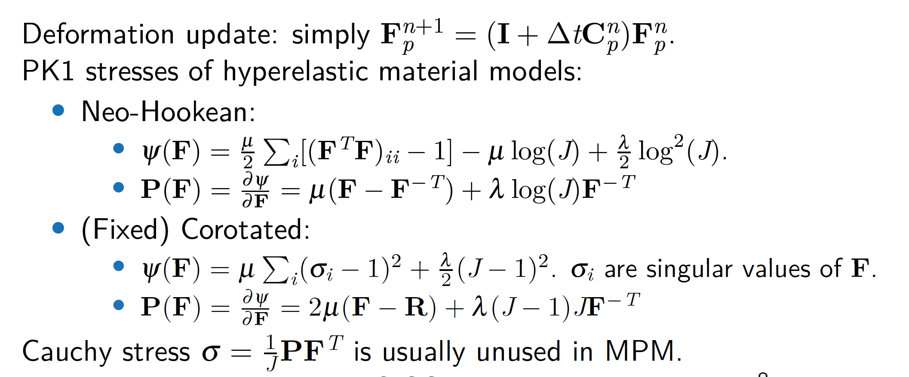
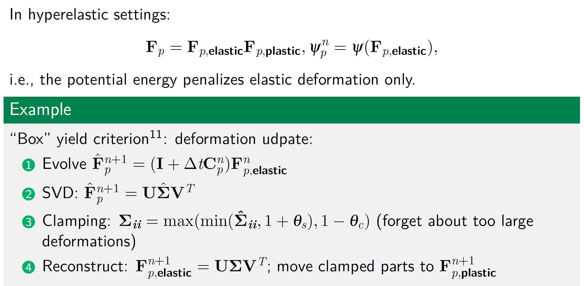
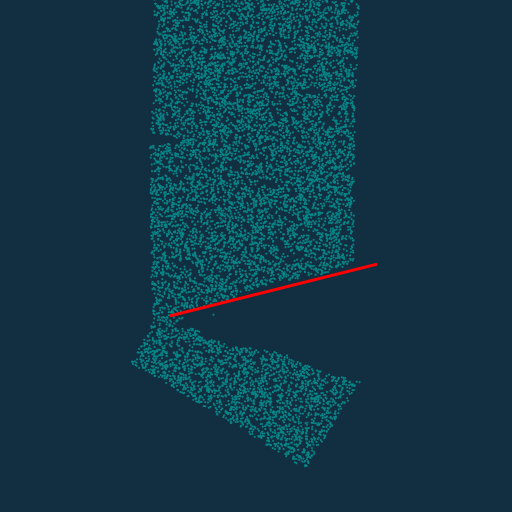

# Simulation with Taichi
<!-- @import "[TOC]" {cmd="toc" depthFrom=2 depthTo=5 orderedList=false} -->

<!-- code_chunk_output -->

- [Simulation with Taichi](#simulation-with-taichi)
  - [Taichi language](#taichi-language)
  - [Taichi syntax basics](#taichi-syntax-basics)
    - [Data format](#data-format)
    - [Kernel and function](#kernel-and-function)
    - [For loops](#for-loops)
    - [Atomic operations](#atomic-operations)
    - [Scope](#scope)
    - [Phases of a Taichi program](#phases-of-a-taichi-program)
    - [Debug mode](#debug-mode)
  - [Lagrangian and Eulerian View](#lagrangian-and-eulerian-view)
    - [Lagrangian simulation approaches (1)](#lagrangian-simulation-approaches-1)
      - [Mass-spring system](#mass-spring-system)
      - [Time integration](#time-integration)
      - [Explicit v.s. implicit time integration](#explicit-vs-implicit-time-integration)
      - [Lagrangian fluid simulation: Smoothed particle hydrodynamics(SPH)](#lagrangian-fluid-simulation-smoothed-particle-hydrodynamicssph)
      - [Output mp4 and gif in taichi](#output-mp4-and-gif-in-taichi)
    - [Lagrangian simulation approaches (2)](#lagrangian-simulation-approaches-2)
      - [Basics of deformation, elasticity and FEM](#basics-of-deformation-elasticity-and-fem)
      - [Taichi programming language advanced features](#taichi-programming-language-advanced-features)
        - [ODOP](#odop)
        - [Metaprogramming](#metaprogramming)
        - [Differentiable programming](#differentiable-programming)
        - [Visualization](#visualization)
    - [Eulerian Fluid Simulation](#eulerian-fluid-simulation)
      - [Gradient](#gradient)
      - [Divergence](#divergence)
      - [Curl](#curl)
      - [Laplace operator $\Delta$](#laplace-operator-delta)
    - [Poisson's Equation and Fast Method](#poissons-equation-and-fast-method)
  - [Linear FEM and Topology optimization](#linear-fem-and-topology-optimization)
    - [FEM overview](#fem-overview)
    - [Discretizing Poisson's equation](#discretizing-poissons-equation)
      - [2D Poisson's equation](#2d-poissons-equation)
      - [Weak formulation](#weak-formulation)
      - [Getting rid of second-order terms](#getting-rid-of-second-order-terms)
      - [Discretization](#discretization)
    - [Discretizing linear elasticity](#discretizing-linear-elasticity)
      - [Linear elasticity FEM](#linear-elasticity-fem)
      - [Index notation](#index-notation)
      - [Discretize Cauchy momentum equation using FEM](#discretize-cauchy-momentum-equation-using-fem)
      - [Building the linear system](#building-the-linear-system)
    - [Topology optimization](#topology-optimization)
  - [Hybrid Eulerian-Lagrangian](#hybrid-eulerian-lagrangian)
    - [Particle-in-cell (PIC/APIC/FLIP)](#particle-in-cell-picapicflip)
      - [Interpolation function (kernel)](#interpolation-function-kernel)
    - [Material Point Method (MPM)](#material-point-method-mpm)
      - [Traditional MPM](#traditional-mpm)
        - [Deformation gradient](#deformation-gradient)
        - [Push forward and pull back (lagrangian and eulerian function)](#push-forward-and-pull-back-lagrangian-and-eulerian-function)
        - [Constitutive model](#constitutive-model)
        - [Governing equations](#governing-equations)
        - [Material particles](#material-particles)
          - [Interpolation function](#interpolation-function)
          - [Lagrangian/Eulerian mass](#lagrangianeulerian-mass)
          - [Lagrangian/Eulerian momentum](#lagrangianeulerian-momentum)
        - [Discretization](#discretization-1)
          - [Discrete time](#discrete-time)
          - [Discrete space](#discrete-space)
          - [Estimating volume](#estimating-volume)
          - [Deformation gradient evolution](#deformation-gradient-evolution)
          - [Forces as energy gradient](#forces-as-energy-gradient)
        - [Explicit time integration scheme](#explicit-time-integration-scheme)
        - [Implicit time integration](#implicit-time-integration)
        - [Collison objects](#collison-objects)
        - [Lagrangian forces](#lagrangian-forces)
      - [MLS-MPM (Moving Least Squares MPM)](#mls-mpm-moving-least-squares-mpm)
        - [:ghost: PIC](#ghost-pic)
        - [:ghost: APIC](#ghost-apic)
        - [:ghost: MLS-MPM](#ghost-mls-mpm)
      - [Constitutive Models](#constitutive-models)
        - [Elastic solids](#elastic-solids)
        - [Weakly compressible fluids](#weakly-compressible-fluids)
        - [Elastoplastic solids](#elastoplastic-solids)
        - [Singular value decomposition (SVD)](#singular-value-decomposition-svd)
      - [Lagrangian forces in MPM](#lagrangian-forces-in-mpm)
      - [Introducing Taichi "field"](#introducing-taichi-field)
      - [MPM Extension](#mpm-extension)
      - [Moving least squares method (MLS)](#moving-least-squares-method-mls)
        - [Least squares (LS)](#least-squares-ls)
        - [Weighted least squares (WLS)](#weighted-least-squares-wls)
        - [Moving least squares (MLS)](#moving-least-squares-mls)
      - [CPIC (Compatible PIC)](#cpic-compatible-pic)
      - [MPM-DEM Coupling](#mpm-dem-coupling)
  - [High performance physical simulation](#high-performance-physical-simulation)
    - [Hardware Architecture](#hardware-architecture)
      - [Background](#background)
      - [Locality](#locality)
    - [Advanced Taichi Programming](#advanced-taichi-programming)
      - [Structural Nodes (SNodes)](#structural-nodes-snodes)
  - [THE END](#the-end)

<!-- /code_chunk_output -->

## Taichi language
==Decouple== data structure from computation.
stencil
Spatial sparsity is specially treated in taichi. Different data structures can be used to process this sparsity in the compiler.
Single program multiple data (SPMD)
Data structure: array of structure(AOS) & structure of array(SOA)

## Taichi syntax basics
The gene of Taichi is parallel computing.
### Data format
==Tensor== is a multidim array whose elements can be everything even matrices.
```python
import taichi as ti
ti.init()

a = ti.var(dt=ti.f32, shape=(42,63)) # a tensor of 42X63 scalars
b = ti.Vector(3, dt=ti.f32, shape=4) # a tensor of 4X3D vectors
c = ti.Matrix(2,2,dt=ti.f32,shape=(3,5)) # a tensor of 3X5 2X2 matrices
# ti.* defines the type of each element and the first part defines the size of each element
loss = ti.var(dt=ti.f32, shape=()) # this is a scalar defined in tensor form
loss[None]=3 # use this to assign value to a scalar in a tensor form
```

### Kernel and function
In Taichi, kernel is the computation function.
Kernels must be decorated with @ti.kernel. They can call functions but cannot be call other kernels.
Taichi functions can be called directly by Taichi kernels and other Taichi functions but not python. Only **one return** is supported up to now. They must be decorated with @ti.func.

Element-wise product *; marix product @.

### For loops
For loops in Taichi have 2 forms.
+ Range-for loops: Similar to Python. Will be parallelized when used at the outermost scope.
+ Struct-for loops: Iterates over (sparse) tensor elements.
For loops at the outermost scope in Taichi is **automatically parallelized**.

```py
ti.init(arch=ti.gpu)
n = 320
pixels = ti.var(dt=ti.f32, shape=(2*n, n))
@ti.kernel
def paint(t:ti.f32):
    for i,j in pixels:
        pixels[i,j] = i*3+j*4+t
```

### Atomic operations
Atomic operation is designed to deal with parallel computing. An atomic operation will go from start to finish without interruption of other threads.
In Taichi, augmented assignments (x[i]+=1)
```py
a[None] += 1 [right]
ti.atomic_add(a[None], 1) [right]
a[None] = a[None] + 1 [wrong]
```

### Scope
Taichi-scope: in @ti.kernel or @ti.func. Compiled in Taichi and run in parallel.

Python-scope: Compiled in Python.

### Phases of a Taichi program
+ Initialization: ti.init(...)
+ Tensor allocation: ti.var, ti.Vector, ti.Matrix
+ Computation (lauch kernels...)
+ Optional: restart the Taichi system (clear memory, destroy variables and kernels...) ti.reset()
  

> :grey_exclamation::eyes: After the first ti.kernel, no more tensor allocation is allowed.

```py
# fractal.py
import taichi as ti
ti.init(arch=ti.cpu)

n=320
pixels = ti.var(dt=ti.f32, shape=(2*n, n))

@ti.func
def complex_sqr(z):
    return ti.Vector([z[0]**2 - z[1]**2, z[1] * z[0] *2])

@ti.kernel
def paint(t: ti.f32):
    for i,j in pixels:
        c = ti.Vector([-0.8, ti.cos(t) * 0.2])
        z = ti.Vector([i/n - 1, j/n - 0.5]) * 2
        iterations = 0
        while z.norm() < 20 and iterations < 50:
            z = complex_sqr(z) + c
            iterations += 1
        pixels[i, j] = 1 - iterations * 0.02

gui = ti.GUI("Julia Set", res=(n * 2, n))
for i in range(1000000):
    paint(i * 0.03)
    gui.set_image(pixels)
    gui.show()
```

### Debug mode
debug = True (cpu only)
```py
ti.init(debug=True, arch=ti.cpu)
a = ti.var(dt=ti.f32, shape=(10))
b = ti.var(dt=ti.f32, shape=(10))
@ti.kernel
def shift():
    for i in range(10):
        a[i] = b[i+1]
# bound checker is only activated in debug mode to save time in normal mode.
shift()
```

## Lagrangian and Eulerian View

Lagrangian view: move with object.

Eulerian view: static.

### Lagrangian simulation approaches (1)

#### Mass-spring system
$$
\begin{aligned}
    \mathbf{f}{ij}&=-k(\|\mathbf{x}_i-\mathbf{x}_j\|_2-l_{ij})(\widehat{\mathbf{x}_i-\mathbf{x}_j})\quad(\rm Hooke's\,law)\\
    \mathbf{f}_i&=\sum_j^{j\neq i}\mathbf{f}_{ij}\\
    \frac{\partial \mathbf{v}_i}{\partial t}&=\frac{1}{m_i}\mathbf{f}_i\quad(\rm Newton's\,second\,law\,of\,motion)\\
    \frac{\partial \mathbf{x}_i}{\partial t}&=\mathbf{v}_i\\
\end{aligned}
$$

$\widehat{\mathbf{x}_i-\mathbf{x}_j}$: direction vector from particle $i$ to particle $j$ (unit vector).
$\widehat{\Box}$ means **normalization**.

**Implicit time integration:**

with taylor expansion


To solver this linear system, there are many methods like Jacobi iteration/Gauss-Seidel iteration or conjugate gradients(共轭梯度), etc.
**Unifying explict and implicit:**

**Solve faster**
For system with millions of mass points and springs,
+ Sparse matrices
+ Conjugate gradients
+ Preconditioning
+ Use position-based dynamics(PBD)
+ Also some faster approches like Fast mass-spring system solver("Fast simulation of mass-spring systems" in ACM Transactions)


#### Time integration
:one: Forward Euler (explicit)
$$
\begin{aligned}
\mathbf{v}_{t+1}&=\mathbf{v}_t+\Delta t\frac{\mathbf{f}_t}{m}\\
\mathbf{x}_{t+1}&=\mathbf{x}_t+\Delta t\mathbf{v}_t\\
\end{aligned}
$$

:two: Semi implicit Euler (aka. symplectic Euler, explicit)
$$
\begin{aligned}
\mathbf{v}_{t+1}&=\mathbf{v}_t+\Delta t\frac{\mathbf{f}_t}{m}\\
\mathbf{x}_{t+1}&=\mathbf{x}_t+\Delta t\mathbf{v}_{t+1}\\
\end{aligned}
$$

```py
# mass_spring.py

```

:three: Backward Euler (often with Newton's method, implicit)

#### Explicit v.s. implicit time integration
Explicit (forward Euler, symplectic Euler, RK, ...)
$$\Delta t \leq c\sqrt{\frac{m}{k}} \quad c\approx1$$ 

Implicit (backward Euler, middle-point, ...)

#### Lagrangian fluid simulation: Smoothed particle hydrodynamics(SPH)
**Courant-Friedrichs-Lewy(CFL) condition**
Another threshold

**Accelerating SPH: Neighborhood search**


#### Output mp4 and gif in taichi
ti.imwrite(img, filename)
ti video -f 24 or ti video -f 60
ti git -i input.mp4

Make sure ffmpeg installed!

### Lagrangian simulation approaches (2)

#### Basics of deformation, elasticity and FEM
**Deformation**
Deformation map $\phi$:$$\mathbf{x}_{\rm deformed}=\phi(\mathbf{x}_{\rm rest})$$

> This relates rest material position with deformed material position.

Deformation gradient $\mathbf{F}$:$$\mathbf{F}:=\frac{\partial\mathbf{x}_{\rm deformed}}{\partial\mathbf{x}_{\rm rest}}$$

> Deformation gradients are translational invariant.
> $\phi_1=\phi(\mathbf{x}_{\rm rest})$ and $\phi_2=\phi(\mathbf{x}_{\rm rest})+\rm c$ have the same $\mathbf{F}$.

Deform/rest volume ratio $J=\det(\mathbf{F})$

**Elasticity**
Hyperelasticity
whose stress-strain relationship is defined by **strain energy density function**.
$$\psi=\psi(\mathbf{F})$$

There are different measures of stress:
* THe First Piola-Kirchhoff stress tensor (PK1):$\mathbf{P}(\mathbf{F})=\frac{\partial\psi(\mathbf{F})}{\partial\mathbf{F}}$ (easy to compute but in rest space)
* Kirchhoff stress: $\boldsymbol{\tau}$
* Cauchy stress tensor: $\boldsymbol{\sigma}$ (symmetric)

Relationship: $\boldsymbol{\tau}=J\boldsymbol{\sigma}=\mathbf{P}\mathbf{F}^T\quad\mathbf{P}=J\boldsymbol{\sigma}\mathbf{F}^{-T}\quad \rm Traction\,\mathbf{t}=\boldsymbol{\sigma}^T\boldsymbol{n}$

* Young's modulus $E = \frac{\sigma}{\varepsilon}$
* Bulk modulus $K = -V\frac{dP}{dV}$
* Poisson's ratio $\nu\in[0,0.5)$
* Lame's first parameter $\mu$; Lame's second parameter $\lambda$ (aka. shear modulus $G$)

conversion formula:
$$K=\frac{E}{3(1-2\nu)}\qquad\lambda=\frac{E\nu}{(1+\nu)(1-2\nu)}\qquad\mu=\frac{E}{2(1+\nu)}$$

Popular hyperelastic material models (for each element)
* Neo-Hookean
  * $\psi(\mathbf{F})=\frac{\mu}{2}\sum_i[(\mathbf{F}^T\mathbf{F})_{ii}-1]-\mu\log(J)+\frac{\lambda}{2}\log^2(J)$
  * $\mathbf{P}(\mathbf{F})=\frac{\partial\psi(\mathbf{F})}{\partial\mathbf{F}}=\mu(\mathbf{F}-\mathbf{F}^{-T})+\lambda\log(J)\mathbf{F}^{-T}$
* (Fixed) Corotated
  * $\psi(\mathbf{F})=\mu\sum_i(\mathbf{\sigma}_i-1)^2+\frac{\lambda}{2}(J-1)^2$
  * $\mathbf{P}(\mathbf{F})=\frac{\partial \psi}{\partial \mathbf{F}}=2\mu(\mathbf{F}-\mathbf{R})+\lambda(J-1)J\mathbf{F}^{-T}$

**FEM**
Linear tetrahedral FEM
The deformation map $\phi$ is affine and thus deformation gradient $\mathbf{F}$ is **constant** within a single tetrahedral element:
$$\rm \mathbf{x}_{deformed}=\mathbf{F}\mathbf{x}_{rest}+\mathbf{b}$$

For every element $e$, its elastic potential energy
$$U(e)=\int_e\psi(\mathbf{F}(\mathbf{x}))\mathbf{x}=V_e\psi(\mathbf{F}_e)$$

For explicit scheme (semi-implicit)
$$\mathbf{v}_{t+1,i}=\mathbf{v}_{t,i}+\Delta t\frac{\mathbf{f}_{t,i}}{m_i}$$

$$\mathbf{x}_{t+1,i}=\mathbf{x}_{t,i}+\Delta t\mathbf{v}_{t+1,i}$$

$$\mathbf{f}_{t,i}\equiv-\frac{\partial U}{\partial \mathbf{x}_i}=-\sum_e\frac{\partial U(e)}{\partial \mathbf{x}_i}=-\sum_e V_e\frac{\partial\psi(\mathbf{F}_e)}{\partial\mathbf{F}_e}\frac{\partial \mathbf{F}_e}{\partial \mathbf{x}_i}=-\sum_eV_e\mathbf{P}(\mathbf{F}_e)\frac{\partial\mathbf{F}_e}{\partial\mathbf{x}_i}$$

#### Taichi programming language advanced features
##### ODOP
Data-oriented programming (DOP)
Objective data-oriented programming (ODOP)
+ 3 important decorators
  + Use @ti.data_oriented to decorate class.
  + Use @ti.kernel to decorate class members functions that are Taichi kernels.
  + Use @ti.func to decorate class members functions that are Taichi functions.

##### Metaprogramming
+ Allow to pass almost anything to Taichi kernels
+ Improve run-time performance by moving run-time costs to compile time
+ Achieve dimensionality independence
+ Simplify the development of Taichi standard library
```py
@ti.kernel
def copy(x: ti.template(), y: ti.template(), c: ti.f32):
    for i in x:
        y[i] = x[i] + c
```
Variable aliasing
##### Differentiable programming
reverse-mode automatic differentiation (AutoDiff)
$$f(x)\Rightarrow\frac{\partial f(x)}{\partial x}$$
##### Visualization


### Eulerian Fluid Simulation
#### Gradient
梯度
Hamilton operator $\nabla=(\frac{\partial}{\partial x_1},\frac{\partial}{\partial x_2},\dots,\frac{\partial}{\partial x_n})$
对于标量场$F(x_1,x_2,\dots,x_n)$,其梯度为矢量$\nabla F=(\frac{\partial F}{\partial x_1},\frac{\partial F}{\partial x_2},\dots,\frac{\partial F}{\partial x_n})$ 
对于矢量场$\boldsymbol{F}(x_1,x_2,\dots,x_n)=(F_1,F_2,\dots,F_n)$,
其梯度为二阶张量$\nabla\boldsymbol{F}_{ij}=\frac{\partial F_i}{\partial x_j}$ (Jacobi matrix)
对于标量场，其旋度为其梯度最大的方向，且梯度大小即为旋度模量。

#### Divergence
散度
“径向发散概念”
散度作用于矢量场得到标量
$\rm{div}\boldsymbol{F}=\nabla\cdot\boldsymbol{F}=\frac{\partial F_1}{\partial x_1}+\frac{\partial F_2}{\partial x_2}+\dots+\frac{\partial F_n}{\partial x_n}$
散度表示空间矢量场各点发散的强弱程度，物理意义为表征场的有源性，为场量在该点通量的体密度。
* $\rm{div}\boldsymbol{F}>0$表示该点为正源（发散源）；
* $\rm{div}\boldsymbol{F}<0$表示该点为负源（洞或汇）；
* $\rm{div}\boldsymbol{F}=0$表示该点无源。

可以用于理解高斯公式（高斯散度定理）
$\int_V\nabla\cdot\boldsymbol{F}\,dV=\int_S\boldsymbol{F}\cdot\,d\boldsymbol{S}$
即封闭区域表面通量之和等于体积域内旋度即通量体密度的体积积分。

通量为单位时间内通过某个曲面的量
散度即通量强度

#### Curl
旋度
“周向发散概念”
旋度作用于矢量场得到矢量
对于三维场量$\boldsymbol{F}=F_x\hat i+F_y\hat j+F_z\hat k$
其旋度可以表示为
$$\rm{curl}\boldsymbol{F}=\nabla\times\boldsymbol{F}=\begin{vmatrix}
    \hat i&\hat j&\hat k\\
    \frac{\partial}{\partial x}&\frac{\partial}{\partial y}&\frac{\partial}{\partial z}\\
    F_x&F_y&F_z\\
\end{vmatrix}$$

环流量是单位时间内环绕某个曲线的量
旋度是环流量强度
其方向符合右手定则

#### Laplace operator $\Delta$
拉普拉斯算子为梯度$\nabla$的散度$\nabla\cdot$
对于标量场函数$F$
$\Delta F=\nabla\cdot\nabla F=(\frac{\partial}{\partial x_1},\frac{\partial}{\partial x_2},\dots,\frac{\partial}{\partial x_n})\cdot(\frac{\partial F}{\partial x_1},\frac{\partial F}{\partial x_2},\dots,\frac{\partial F}{\partial x_n})=\sum_{i=1}^n\frac{\partial^2 F}{\partial x_i^2}$

advection
projection
Velocity-pressure formula(速度-压力型式N-S)
Velocity-vorticity formula(速度-旋度型式N-S):涡方法
$$\nabla \cdot (\nabla p)=\Delta p=\frac{\rho}{\Delta t}\nabla\cdot \boldsymbol{u}$$
Poisson's equation:
$$\Delta p=f$$
Laplace's equation:
$$\Delta p=0$$
Some simple explicit time integration schemes
* Forward Euler("RK1")
$$\rm{p-=dt*velocity(p)}$$
* Explicit Midpoint("RK2")
$$\rm{p\_mid=p-0.5*dt*velocity(p)}$$

$$\rm{p-=dt*velocity(p\_mid)}$$
* RK3
$$\begin{aligned}
    v1&=velocity(p)\\
    p1&=p-0.5*dt*v1\\
    v2&=velocity(p1)\\
    p2&=p-0.75*dt*v2\\
    v3&=velocity(p2)\\
    p&-=dt*(2/9*v1+1/3*v2+4/9*v3)
\end{aligned}$$


### Poisson's Equation and Fast Method
快速多级展开算法(fast multipole method [fmm])
Tree code(Burnus hut)
multipole localpole
M2M Transform
M2L
L2L

[shortcourse_fmm](https://math.nyu.edu/faculty/greengar/shortcourse_fmm.pdf)

Boundary element method

Other fast summation methods:
* PPPM: Combining PDE form and summation forms
* Kernel Independent FMM



## Linear FEM and Topology optimization
### FEM overview
It belongs to the family of Galerkin methods.
- Convert strong (accurate at every point) to weak form
- Integrate by parts
- Use divergence theorem to simplify equations and enforce Neumann boundary conditions
- Discretization (build stiffness matrix and right-hand side)
- Solve the linear system

### Discretizing Poisson's equation
#### 2D Poisson's equation
$\nabla\cdot\nabla u=0$

Dirichlet boundary: displacement(第一类边界条件)
$u(x)=f(x)$
Neumann boundary: some kind of force(第二类边界条件)
$\nabla u(x)\cdot \boldsymbol{n}=g(x)$
#### Weak formulation
Arbitrary 2D test function $w(x)$:
$\nabla\cdot\nabla u=0 \Leftrightarrow \forall w,\iint_\Omega w(\nabla\cdot\nabla u)dA=0$
#### Getting rid of second-order terms
We want to get rid of $\nabla\cdot\nabla$ in $\nabla\cdot\nabla u=0$.
Integrate by parts:
$\nabla w\cdot\nabla u+w\nabla\cdot\nabla u=\nabla\cdot(w\nabla u)$
Since $\nabla\cdot\nabla u=0$, we have
$\nabla w\cdot\nabla u=\nabla\cdot(w\nabla u)$
Thus we have
$\nabla\cdot\nabla u=0 \Leftrightarrow \forall w, \iint_\Omega\nabla w\cdot \nabla u\, dA=\iint_\Omega\nabla\cdot(w\nabla u)dA$.
Apply divergence theorem to RHS(right-hand side)
$\iint_\Omega\nabla w\cdot \nabla u\, dA=\oint_{\partial \Omega} w\nabla u\cdot d\boldsymbol{n}$

#### Discretization
We represent $u(x)$ as 
$u(x)=\sum_j u_j \phi_j(x)$
Substitute this into the former equation
$\forall w, \iint_\Omega\nabla w\cdot \nabla (\sum_j u_j \phi_j)\, dA=\oint_{\partial \Omega} w\nabla u\cdot d\boldsymbol{n}$
We also use basis function $\phi_i$ as the test function $w$, and we have
$\forall i, \iint_\Omega\nabla \phi_i\cdot \nabla (\sum_j u_j \phi_j)\, dA=\oint_{\partial \Omega} \phi_i\nabla u\cdot d\boldsymbol{n}$
Extract $\sum_j u_j$ out of $\iint$
$\forall i, \sum_j(\iint_\Omega\nabla \phi_i\cdot \nabla \phi_j\, dA)u_j=\oint_{\partial \Omega} \phi_i\nabla u\cdot d\boldsymbol{n}$
In matrix form
$\boldsymbol{Ku=f}$

- Dirichlet BCs $u(x)=f(x), x\in \partial\Omega$:
set $u_i=f(x_i)$
- Neumann BCs $\nabla u(x)\cdot\boldsymbol{n}=g(x),x\in\partial\Omega$: 
Plug g into the RHS of the equation, which yields non-zeros in $\boldsymbol{f}$. (Some kind of force)
### Discretizing linear elasticity
#### Linear elasticity FEM
Cauchy momentum equation
$\frac{Dv}{Dt}=\frac{1}{\rho}\nabla\cdot\sigma+g$
v: velocity
$\rho$: density
$\sigma$: cauchy stress tensor
g: body force

For quasi-static state($v=0$), constant density, no gravity:
$\nabla\cdot\sigma=0$
#### Index notation
$\frac{Dv}{Dt}=\frac{1}{\rho}\nabla\cdot\sigma+g \Leftrightarrow \frac{Dv_\alpha}{Dt}=\frac{1}{\rho}\sum_\beta \sigma_{\alpha\beta,\beta}+g_\alpha$
#### Discretize Cauchy momentum equation using FEM
$\forall\alpha\forall i, \iint_\Omega\sum_\beta[\sigma(u(x))]_{\alpha\beta}\phi_{i\alpha}(x)dA=\oint_{\partial\Omega}\sum_\beta(\sigma_{\alpha\beta}\phi_{i\alpha}dn_\beta)$
#### Building the linear system
If $\sigma$ is a linear function of $u$,
$Ku=f$ can be explicitly expressed.

### Topology optimization
simp(Solid Isotropic Material with Penalization) 
oc(Optimility Criterion)
minimize deformation energy

The most common topology optimization problem is minimal compliance:
$$
\begin{aligned}
  \min\quad L(\rho)&=u^TK(\rho)u\\
  s.t. \quad K(\rho)u&=f\\
  \sum_e \rho_e&\leq cV\\
  \rho_e&\in [\rho_{\min},1]\\
\end{aligned}
$$

$L$: measure of deformation energy, or the loss function
$c$: volume fraction ($c \in (0,1]$)
$\rho_e$: material occupancy of cell $e$ (0=empty, 1=filled, $\rho$ is usually $10^{-2}$ or $10^{-3}$.)
$V$: total volume

## Hybrid Eulerian-Lagrangian
A fluid solver usually has 2 components:
- Advection (evolving the fields)
- Projection (enforcing incompressibility)

Eulerian grid is good at projection. (the grids are fixed and is suitable for searching for neighbors)
Lagrangian particles are good at advection. (just move the particles)

Combine them together where lagrangian particles store most of the information while eulerian grids are auxiliary.


### Particle-in-cell (PIC/APIC/FLIP)
Use particles to carry information while grid as the framework.

P2G (particle to grid): transfer info from particles to grids using kernel functions (scatter).

G2P (grid to particle): transfer info from grid to particle (gather). [Angular momentum is not conserved.]

The particles interact with each other through grids.

$p$ refers to particle and $i$ refers to grid.

:dog: Energy dissipation (numerical diffusion) is obvious.
DOF is lost during G2P??.
DOFs of particles are lost in P2G=>G2P since typically the number of particles is much more than that of grids. In G2P, particle velocities are totally overwritten from grids thus some information of particles is lost. In FLIP, the particle velocities are incremented rather than overwritten.

2 solutions:
- Transfer more information (rotation...): APIC,PolyPIC
**APIC**[affine particle in cell] + bilibili video
**highly recommended for homework**
**PolyPIC**[polynomial particle in cell]
- Transfer the delta: FLIP
**FLIP**[fluid implicit particles]
gather $\Delta$ of the physical quantities rather than themselves.
PIC: $v_p^{t+1}=gather(v_i^{t+1})$
FLIP: $v_p^{t+1}=v_p^t+gather(v_i^{t+1}-v_i^{t})$
PIC is dissipative while FLIP is too noisy.
Combine!! $\Rightarrow$ FLIP0.99=FLIP * 0.99+PIC * 0.01

To know more about **APIC** and its difference with **PIC** and **FLIP**, refer to *An angular momentum conserving affine-particle-in-cell method (2017JCP)*.
**PIC** loses information during the mapping cycle P2G/G2P thus energy dissipation occurs.
**FLIP** transfers incremental information during cycle and preserves each particle's original information to some extent however too much noise occurs.
**APIC** transfers more information like velocity gradient matrix thus the energy dissipation can be avoided to some extent.

PIC is almost never used in graphics.
APIC is suggested to start with.

```py
# pic_vs_apic.py
# In this program, initial velocities is given. How to enforce forces?
import taichi as ti
import random
ti.init(arch=ti.gpu)

dim = 2
n_particles = 8192
# number of grid points along each axis
n_grid = 32
dx = 1 / n_grid
inv_dx = 1 / dx
dt = 2.0e-3
use_apic = False

# coordinates of particles
x = ti.Vector.field(dim, dtype=ti.f32, shape=n_particles)
# velocities of particles
v = ti.Vector(dim, dt=ti.f32, shape=n_particles)
C = ti.Matrix(dim, dim, dt=ti.f32, shape=n_particles)
grid_v = ti.Vector(dim, dt=ti.f32, shape=(n_grid, n_grid))
#grid_m = ti.var(dt=ti.f32, shape=(n_grid, n_grid))
grid_m = ti.field(dtype=ti.f32, shape=(n_grid, n_grid))

@ti.func
def clamp_pos(pos):
    return ti.Vector([max(min(0.95, pos[0]), 0.05), max(min(0.95, pos[1]), 0.05)])

@ti.kernel
def substep_PIC():
    # P2G
    for p in x:
        # create a local coordinate system, base as the origin
        base = (x[p] * inv_dx - 0.5).cast(int)
        fx = x[p] * inv_dx - base.cast(float)
        # Quadratic B-spline (quadratic kernel)
        # assume particle mass is 1.
        w = [0.5 * (1.5 - fx) ** 2, 0.75 - (fx - 1) ** 2, 0.5 * (fx - 0.5) ** 2]
        for i in ti.static(range(3)):
            for j in ti.static(range(3)):
                offset = ti.Vector([i, j])
                weight = w[i][0] * w[j][1]
                grid_v[base + offset] += weight * v[p]
                grid_m[base + offset] += weight
    # Grid normalization
    for i, j in grid_m:
        if grid_m[i, j] > 0:
            inv_m = 1 / grid_m[i, j]
            grid_v[i, j] = inv_m * grid_v[i, j]
    # G2P
    for p in x:
        base = (x[p] * inv_dx - 0.5).cast(int)
        fx = x[p] * inv_dx - base.cast(float)
        # Quadratic B-spline
        w = [
            0.5 * (1.5 - fx) ** 2, 0.75 - (fx - 1.0) ** 2, 0.5 * (fx - 0.5) ** 2
        ]
        new_v = ti.Vector.zero(ti.f32, 2)
        for i in ti.static(range(3)):
            for j in ti.static(range(3)):
                weight = w[i][0] * w[j][1]
                new_v += weight * grid_v[base + ti.Vector([i, j])]

        x[p] = clamp_pos(x[p] + v[p] * dt)
        v[p] = new_v

@ti.kernel
def substep_APIC():
    for p in x:
        base = (x[p] * inv_dx - 0.5).cast(int)
        fx = x[p] * inv_dx - base.cast(float)
        # Quadratic B-spline
        w = [0.5 * (1.5 - fx) ** 2, 0.75 - (fx - 1) ** 2, 0.5 * (fx - 0.5) ** 2]
        affine = C[p]
        for i in ti.static(range(3)):
            for j in ti.static(range(3)):
                offset = ti.Vector([i, j])
                dpos = (offset.cast(float) - fx) * dx
                weight = w[i][0] * w[j][1]
                grid_v[base + offset] += weight * (v[p] + affine @ dpos)
                grid_m[base + offset] += weight
    
    for i, j in grid_m:
        if grid_m[i, j] > 0:
            inv_m = 1 / grid_m[i, j]
            grid_v[i, j] = inv_m * grid_v[i, j]
    
    for p in x:
        base = (x[p] * inv_dx - 0.5).cast(int)
        fx = x[p] * inv_dx - base.cast(float)
        # Quadratic B-spline
        w = [
            0.5 * (1.5 - fx) ** 2, 0.75 - (fx - 1.0) ** 2, 0.5 * (fx - 0.5) ** 2
        ]
        new_v = ti.Vector.zero(ti.f32, 2)
        new_C = ti.Matrix.zero(ti.f32, 2, 2)
        for i in ti.static(range(3)):
            for j in ti.static(range(3)):
                # the dx in dpos is eliminated in the computation of new_C!!
                dpos = ti.Vector([i, j]).cast(float) - fx
                g_v = grid_v[base + ti.Vector([i, j])]
                weight = w[i][0] * w[j][1]
                new_v += weight * g_v
                # where is dx^2 ?? only 1 inv_dx is presented here!!
                # the other dx is eliminated with that in dpos.
                new_C += 4 * weight * g_v.outer_product(dpos) * inv_dx

        x[p] = clamp_pos(x[p] + new_v * dt)
        v[p] = new_v
        C[p] = new_C

@ti.kernel
def reset(mode: ti.i32):
    for i in range(n_particles):
        x[i] = [ti.random() * 0.6 + 0.2, ti.random() * 0.6 + 0.2]
        if mode == 0:
            v[i] = [1, 0]
        elif mode == 1:
            v[i] = [x[i][1] - 0.5, 0.5 - x[i][0]]
        elif mode == 2:
            v[i] = [0, x[i][0] - 0.5]
        else:
            v[i] = [0, x[i][1] - 0.5]
        
reset(1)

gui = ti.GUI("PIC v.s. APIC", (512, 512))
for frame in range(2000000):
    if gui.get_event(ti.GUI.PRESS):
        if gui.event.key == 't': reset(0)
        elif gui.event.key == 'r': reset(1)
        elif gui.event.key == 's': reset(2)
        elif gui.event.key == 'd': reset(3)
        elif gui.event.key in [ti.GUI.ESCAPE, ti.GUI.EXIT]: break
        elif gui.event.key == 'a': use_apic = not use_apic
    for s in range(10):
        grid_v.fill([0, 0])
        grid_m.fill(0)
        if use_apic:
            substep_APIC()
        else:
            substep_PIC()
    scheme = 'APIC' if use_apic else 'PIC'
    gui.clear(0x112F41)
    gui.text('(D) Reset as dilation', pos=(0.05, 0.25))
    gui.text('(T) Reset as translation', pos=(0.05, 0.2))
    gui.text('(R) Reset as rotation', pos=(0.05, 0.15))
    gui.text('(S) Reset as shearing', pos=(0.05, 0.1))
    gui.text(f'(A) Scheme={scheme}', pos=(0.05, 0.05))
    gui.circles(x.to_numpy(), radius=3, color=0x068587)
    gui.show()
```

#### Interpolation function (kernel)
There are mainly 3 kinds of interpolation function used in PIC/APIC/MPM.

For both PIC and APIC, information transfer occurs between each particle ($p$) and its surrounding 4(linear)/9(quadratic)/16(cubic) grid points ($i$). In the figures below, each red particle inside intersects with the surrounding blue grid points through the **kernel function**, which is defined on grid points.
**Linear**
<div align=center></div>

**Quadratic**
<div align=center></div>

**Cubic**
<div align=center></div>


During P2G and G2P cycle, the velocity is kind of smoothed and energy dissipation occurs.

APIC conserves angular momentum!
**Angular momentum conservation (角动量守恒)**
Angular momentum (角动量): $m\mathbf{r}\times \mathbf{v}$
Moment (力矩): $\mathbf{r}\times\mathbf{F}$
其中$\mathbf{r}$为位置矢量。
角动量守恒条件：合力矩为0
根本在于$\mathbf{F}=m\mathbf{a} \Rightarrow \mathbf{r}\times\mathbf{F}=m\mathbf{r}\times\mathbf{a}$
如果合力矩为0，则速度保持不变，角动量恒定

动量守恒，角动量守恒都源于牛顿第二定律。

合力矩和角动量的关系可以类比合力与动量的关系。


### Material Point Method (MPM)
No elements in MPM.
MPM particles => FEM quadrature points (Gaussian points)
MPM equations are derived using weak formulation.

#### Traditional MPM
Refer to [2016 MPM course](https://www.seas.upenn.edu/~cffjiang/research/mpmcourse/mpmcourse.pdf) for details.

##### Deformation gradient
$\mathbf{X}$: undeformed space.
$\mathbf{x}$: deformed space.
$\phi(\mathbf{X},t)$: deformation map.
Their relationship is denoted with
$$\mathbf{x}=\phi(\mathbf{X},t)$$

For translation: $\mathbf{x}=\mathbf{X}+vt\mathbf{n}$
where $\mathbf{n}$ is the moving direction.
For rotation: $\mathbf{x}=\mathbf{R}\mathbf{X}+\mathbf{b}$
where $\mathbf{R}$ is the rotation matrix.(For 2D cases, $\mathbf{R}=\begin{bmatrix}
  \cos\theta & -\sin\theta\\ \sin\theta & \cos\theta
\end{bmatrix}$)

Deformation gradient:
$$\mathbf{F}=\frac{\partial\phi(\mathbf{X},t)}{\partial\mathbf{X}}=\frac{\partial\mathbf{x}(\mathbf{X},t)}{\partial\mathbf{X}}$$

$$F_{ij}=\frac{\partial\phi_i}{\partial X_j}=\frac{\partial x_i}{\partial X_j},\quad i,j=1,\dots,d$$

For rigid translation: $\mathbf{F}=\mathbf{I}_{d\times d}$.
For rigid rotation: $\mathbf{F}=\mathbf{R}$.

The determinant of $\mathbf{F}$:
$$J=\det(\mathbf{F})$$

This characterizes the infinitesimal volume change and represents the **ratio** of the infinitesimal volume of material in configuration $\Omega^t$ to the original volume in $\Omega^0$.

+ $J=1$ means no volume change during the transformation. For rigid motions (rotations and translations), $J=1$.
+ $J>1$ means volume increase.
+ $J<1$ means volume decrease.
+ $J=0$ means volume becomes 0. In the real world this is impossible while numerically it is possible, eg. the material is so compressed that it becomes a plane or a line or a single volumeless point.
+ $J<0$ means the material is inverted. For a 2D triangle, this means one vertex passes through its opposing edge, resulting in negative area.


##### Push forward and pull back (lagrangian and eulerian function)
==Definition：==
Push forward $\Rightarrow$ Eulerian (function of $\mathbf{x}$)
$$v(\mathbf{x},t)=V(\phi^{-1}(\mathbf{x},t),t)$$

where $v$ is the push forward of $V$.
Pull back $\Rightarrow$ Lagrangian (function of $\mathbf{X}$)
$$V(\mathbf{X},t)=v(\phi(\mathbf{X},t),t)$$

where $V$ is the pull back of $v$.

==Material derivative:==
For a general Eulerian function $f(\cdot,t)$,
$$\frac{D}{Dt}f(\mathbf{x},t)=\frac{\partial f(\mathbf{x},t)}{\partial t}+\frac{\partial f(\mathbf{x},t)}{\partial x_j}v_j(\mathbf{x},t)$$

where Eulerian $\frac{D}{Dt}f(\mathbf{x},t)$ is the push forward of $\frac{\partial F}{\partial t}$ and $F$ is a Lagrangian function.

==Volume and area change:==
Volume:
$$v=JdV$$

where $J=\det(\mathbf{F})$, $v\Rightarrow x$(Eulerian), $V\Rightarrow X$(Lagrangian).
Based on this we have
$$\int_{B^t}g(\mathbf{x})d\mathbf{x}=\int_{B^0}G(\mathbf{X})J(\mathbf{X},t)d\mathbf{X}$$

where $g$ is the push forward of $G$.

Area:
$$d\mathbf{s}=\mathbf{F}^{-T}Jd\mathbf{S}\quad or\quad \mathbf{n}ds=\mathbf{F}^{-T}J\mathbf{N}dS$$

where $s$ and $S$ are tiny areas.
Based on this we have
$$\int_{\partial B^t}h(\mathbf{x},t)\cdot\mathbf{n}(\mathbf{x})ds(\mathbf{x})=\int_{\partial B^0}H(\mathbf{X})\cdot\mathbf{F}^{-T}(\mathbf{X},t)N(\mathbf{X})J(\mathbf{X},t)dS(\mathbf{X})$$


##### Constitutive model
For **hyperelastic** material:
PK1 stress (First Piola-Kirchoff stress) $\mathbf{P}$ can be derived from 
$$\mathbf{P}=\frac{\partial\psi(\mathbf{F})}{\partial\mathbf{F}}$$

where $\psi$ is the elastic energy density function (scalar function) and $\mathbf{F}$ is the deformation gradient.
With index notation,
$$P_{ij}=\frac{\partial\psi}{\partial{F_{ij}}}$$

The Cauchy stress can be obtained from
$$\mathbf{\sigma}=\frac{1}{J}\mathbf{P}\mathbf{F}^T=\frac{1}{\det(\mathbf{F})}\frac{\partial\psi}{\partial\mathbf{F}}\mathbf{F}^T$$

2 common hyperelastic materials: Neo-Hookean and Fixed Corotated.
Refer to [elastic solids](#elastic-solids).

##### Governing equations
Conservation of mass + Conservation of momentum

> Determinant differentiation rule:
> For an invertible matrix $\mathbf{A}$,
> $$\frac{\partial\det(\mathbf{A})}{\partial \mathbf{A}}=\det(\mathbf{A}) \mathbf{A}^{-T}$$
> This leads to the commonly used rule:
> $$\frac{\partial\det(\mathbf{F})}{\partial \mathbf{F}}=\det(\mathbf{F}) \mathbf{F}^{-T}$$

==Weak form of force balance==
Mainly based on conservation of momentum.
(Actually momentum theorem rather than conservation).
$$m\Delta\mathbf{v}=\mathbf{F}\Delta t\Leftrightarrow \frac{m\Delta\mathbf{v}}{\Delta t}=\mathbf{F}$$
Lagrangian view:
$$\int_{\Omega^0}Q_i(\mathbf{X},t)R(\mathbf{X},0)A_i(\mathbf{X},t)d\mathbf{X}=\int_{\partial\Omega^0}Q_iT_ids(\mathbf{X})-\int_{\Omega^0}Q_{i,j}P_{ij}d\mathbf{X}$$

Eulerian view:
$$\int_{\Omega^t}q_i(\mathbf{x},t)\rho(\mathbf{x},t)a_i(\mathbf{x},t)d\mathbf{x}=\int_{\partial\Omega^t}q_it_ids(\mathbf{x})-\int_{\Omega^t}q_{i,k}\sigma_{ik}d\mathbf{x}$$

Here $i,j,k$ are component index for dimensions, $t_i$ is the $i$ component of boundary force $\mathbf{t}$. 
LHS (left-hand side) is some kind of momentum change rate over time while RHS is some kind of net force ignoring the external force.

##### Material particles
Momentum and mass are transfered between grid and particle through interpolation function.
Index notation:
Particle $\qquad\Leftrightarrow\qquad$ $p$
Grid $\qquad\Leftrightarrow\qquad$ $i$

###### Interpolation function
The interpolation function is defined over the Eulerian grid rather than on the material particles like the kernel of SPH particles.
$$w_{ip}=N_\mathbf{i}(\mathbf{x}_p)=N(\frac{1}{h}(x_p-x_i))N(\frac{1}{h}(y_p-y_i))N(\frac{1}{h}(z_p-z_i))$$

$$\nabla w_{ip}=\nabla N_{\mathbf{i}}(\mathbf{x}_p)=
\begin{pmatrix}
  \frac{1}{h}N'(\frac{1}{h}(x_p-x_i))N(\frac{1}{h}(y_p-y_i))N(\frac{1}{h}(z_p-z_i))\\
  N(\frac{1}{h}(x_p-x_i))\frac{1}{h}N'(\frac{1}{h}(y_p-y_i))N(\frac{1}{h}(z_p-z_i))\\
  N(\frac{1}{h}(x_p-x_i))N(\frac{1}{h}(y_p-y_i))\frac{1}{h}N'(\frac{1}{h}(z_p-z_i))\\
\end{pmatrix}$$

Refer to [interpolation function](#interpolation-function-kernel) for plots of linear/quadratic/cubic functions.

###### Lagrangian/Eulerian mass
P2G mass transfer:
$$m_i=\sum_p m_p N_i(\mathbf{x}_p)$$

This ensures the conservation of mass through the partition of unity assumption on interpolation function $\sum_i N_i(\mathbf{x}_p)=1$:
$$\sum_i m_i = \sum_i\sum_p m_p N_i(\mathbf{x}_p) = \sum_p m_p \sum_i N_i(\mathbf{x}_p) = \sum_p m_p$$

No G2P mass transfer since the particle mass never changes.
###### Lagrangian/Eulerian momentum
P2G momentum transfer:
$$\begin{aligned}
  (m\mathbf{v})_i &= \sum_p m_p \mathbf{v}_p N_i(\mathbf{x}_p)\\
  \mathbf{v}_i &= \frac{(m\mathbf{v})_i}{m_i}
\end{aligned}$$

Since $\sum_i m\mathbf{v}_i = \sum_i(m\mathbf{v})_i=\sum_p\sum_i m_p \mathbf{v}_p N_i(\mathbf{x}_p)=\sum_p m_p \mathbf{v}_p$, momentum is conserved in P2G transfer.

G2P velocity transfer:
Since particle mass keeps unchanged, only velocity is transfered in G2P rather than momentum.
$$\mathbf{v}_p = \sum_i\mathbf{v}_iN_i(\mathbf{x}_p)$$

Since $\sum_p m_p\mathbf{v}_p=\sum_p m_p\sum_i\mathbf{v}_iN_i(\mathbf{x}_p) = \sum_i\mathbf{v}_i\sum_pm_pN_i(\mathbf{x}_p)=\sum_i m_i \mathbf{v}_i$, momentum is conserved in G2P transfer.
> Note:pig:: Unlike mass, total momentum keeps changing in the system. This is achieved in Grid operations through introducing impulse. Details will be given later.

##### Discretization
In this part, $i,j,k$ denote grid nodes, $\alpha,\beta,\gamma$ denote dimensional components. 
For instance, $q_{i\alpha}$ means the $\alpha$ component of the vector quantity $\mathbf{q}$ that is stored at node $i$.
###### Discrete time
By introducing $a_{\alpha}(\mathbf{x},t^n)=\frac{1}{\Delta t}(v_\alpha^{n+1}(\mathbf{x})-v_\alpha^n(\mathbf{x}))$ into the [weak form governing equation](#governing-equations), we have
$$\begin{aligned}
  &\frac{1}{\Delta t}\int_{\Omega^{t^n}} q_\alpha(\mathbf{x},t^n)\rho(\mathbf{x},t^n)(v_\alpha^{n+1}(\mathbf{x})-v_\alpha^n(\mathbf{x}))d\mathbf{x}\\&=\int_{\partial\Omega^{t^n}}q_\alpha(\mathbf{x},t^n)t_\alpha(\mathbf{x},t^n)ds(\mathbf{x})-\int_{\Omega^{t^n}}q_{\alpha,\beta}(\mathbf{x},t^n)\sigma_{\alpha\beta}(\mathbf{x},t^n)d\mathbf{x}
\end{aligned}$$

###### Discrete space
Further discretize the [weak form force balance equation](#discrete-time) over space, we have 
$$\frac{((mv)_{i\alpha}^{n+1}-(mv)_{i\alpha}^{n})}{\Delta t}=\int_{\partial\Omega^{t^n}}N_i(\mathbf{x})t_\alpha(\mathbf{x},t^n)ds(\mathbf{x})-\int_{\Omega^{t^n}}N_{i,\beta}(\mathbf{x})\sigma_{\alpha\beta}(\mathbf{x},t^n)d\mathbf{x}$$

Assuming we have an estimate of the Cauchy stress $\mathbf{\sigma}_p^n=\mathbf{\sigma}(\mathbf{x}_p^n,t^n)$ at each Lagrangian particle $\mathbf{x}_p^n$, force on the Eulerian grid node $i$ can be written as
$$\int_{\Omega^{t^n}}N_{i,\beta}(\mathbf{x})\sigma_{\alpha\beta}(\mathbf{x},t^n)d\mathbf{x}\approx\sum_p\sigma_{p\,\alpha\beta}^nN_{i,\beta}(\mathbf{x}_p^n)V_p^n$$

where $V_p^n$ is the volume particle $p$ occupied at time $t^n$.

###### Estimating volume
There are mainly 2 methods to estimate.
+ Estimation based on grid density
  $$\begin{aligned}
    &m_p\approx R(\mathbf{X}_p,0)V_p^0\approx \rho(\mathbf{x}_p^n,t^n)V_p^n\\
    &\rho(\mathbf{x}_p^n,t^n)\approx\sum_i\rho_i^nN_i(\mathbf{x}_p^n)\\
    &\rho_i^n=\frac{m_i^n}{\Delta x^d}\\
  \end{aligned}
  $$

  where $\Delta x$ is the size of each Eulerian grid and $d$ is the dimension. 
  Since grid density is easy to compute, the volume can be estimated
  $$V_p^n\approx\frac{m_p}{\rho(\mathbf{x}_p^n,t^n)}\approx\frac{m_p}{\sum_i\frac{m_i^n}{\Delta x^d}N_i(\mathbf{x}_p^n)}=\frac{m_p\Delta x^d}{\sum_i m_i^n N_i(\mathbf{x}_p^n)}$$

+ Estimation based on deformation gradient
  Typically we have
  $$V_p^n \approx J_p^n V_p^0$$

  where $J_p^n = \det(\mathbf{F}_p^n)$.

Baed on the second method and substituting Cauchy stress $\boldsymbol{\sigma}$ with $\frac{1}{J}\mathbf{P}\mathbf{F}^T$, the [force on the Eulerian grid node $i$](#discrete-space) can be further rewritten as
$$\sum_p\sigma_{p\,\alpha\beta}^n N_{i,\beta}(\mathbf{x}_p^n)V_p^n=\sum_p\frac{1}{J_p^n}P_{p\,\alpha\gamma}^n F_{p\,\beta\gamma}^n N_{i,\beta}(\mathbf{x}_p^n)V_p^0J_p^n=\sum_p P_{p\,\alpha\gamma}^n F_{p\,\beta\gamma}^n N_{i,\beta}(\mathbf{x}_p^n)V_p^0$$

Now the discretized weak form force balance equation can be written as
$$\frac{((mv)_{i\alpha}^{n+1}-(mv)_{i\alpha}^{n})}{\Delta t}=\int_{\partial\Omega^{t^n}}N_i(\mathbf{x})t_\alpha(\mathbf{x},t^n)ds(\mathbf{x})-\sum_p P_{p\,\alpha\gamma}^n F_{p\,\beta\gamma}^n N_{i,\beta}(\mathbf{x}_p^n)V_p^0$$

> Note: Different constitutive models are introduced to the scheme by expressing the PK1 stress $\mathbf{P}$ in different ways. 
> In computer graphics, **hyperelastic** material is preferred since it has a well defined potential energy $\psi$ and the PK1 stress can be easily computed as $\mathbf{P}=\frac{\partial\psi}{\partial\mathbf{F}}$.

###### Deformation gradient evolution
$$\begin{aligned}
  &\frac{\partial}{\partial t}\mathbf{F}(\mathbf{X}_p,t^{n+1})\approx\frac{\mathbf{F}_p^{n+1}-\mathbf{F}_p^n}{\Delta t}\\
  &\mathbf{F}_p^{n+1}=\mathbf{F}_p^n+\Delta t \frac{\partial}{\partial t}\mathbf{F}(\mathbf{X}_p,t^{n+1})
\end{aligned}$$

where $\mathbf{F}(\mathbf{X}_p,t^{n+1})$ is simplified as $\mathbf{F}_p^{n+1}$.
Also we have
$$\begin{aligned}
  &\frac{\partial}{\partial t}\mathbf{F}(\mathbf{X},t^{n+1})=\frac{\partial\mathbf{V}}{\partial\mathbf{X}}(\mathbf{X},t^{n+1})=\frac{\partial \mathbf{v}^{n+1}(\mathbf{x})}{\partial\mathbf{x}}\mathbf{F}(\mathbf{X},t^n)\\
  &\mathbf{v}^{n+1}(\mathbf{x})=\sum_i \mathbf{v}_i^{n+1}N_i(\mathbf{x})\\
  &\frac{\partial \mathbf{v}^{n+1}(\mathbf{x})}{\partial\mathbf{x}}=\sum_i \mathbf{v}_i^{n+1}(\frac{\partial N_i(\mathbf{x})}{\partial\mathbf{x}})^T
\end{aligned}$$

Combining them together we have
$$\mathbf{F}_p^{n+1}=(\mathbf{I}+\Delta t\sum_i \mathbf{v}_i^{n+1}(\frac{\partial N_i(\mathbf{x}_p^n)}{\partial\mathbf{x}})^T)\mathbf{F}_p^n$$

Based on this, $\mathbf{F}_p^{n+1}$ can be obtained given $\mathbf{v}_i^{n+1}$ and $\mathbf{F}_p^n$ at each particle.

###### Forces as energy gradient
[Force on the Eulerian grid node](#estimating-volume) (derived from weak form governing equation) can also be derived from energy gradient for hyperelastic material.

##### Explicit time integration scheme
+ Particle to grid (P2G)
  + $(m\mathbf{v})_i^{n+1}=\sum_pw_{ip}(m_p\mathbf{v}_p^n+\mathbf{B}_p(\mathbf{D}_p)^{-1}(\mathbf{x}_i-\mathbf{x}_p))$ (**Grid momentum**)
    > This is from APIC.
    > $$\begin{aligned}\mathbf{C}_p &= \mathbf{B}_p (\mathbf{D}_p)^{-1}\\\mathbf{D}_p &= \sum_i w_{ip} (\mathbf{x}_i-\mathbf{x}_p)(\mathbf{x}_i-\mathbf{x}_p)^T\\ \mathbf{B}_p &= \sum_i w_{ip} \mathbf{v}_i (\mathbf{x}_i-\mathbf{x}_p)^T  \end{aligned}$$
    >
    > For quadratic kernel, $\mathbf{D}_p=\frac{\Delta x^2}{4}\mathbf{I}$ and $\mathbf{C}_p=\frac{4}{{\Delta x}^2}\sum_i w_{ip} \mathbf{v}_i (\mathbf{x}_i-\mathbf{x}_p)^T$;
    > For cubic kernel, $\mathbf{D}_p=\frac{\Delta x^2}{3}\mathbf{I}$ and $\mathbf{C}_p=\frac{3}{{\Delta x}^2}\sum_i w_{ip} \mathbf{v}_i (\mathbf{x}_i-\mathbf{x}_p)^T$;
    > For linear kernel, $\mathbf{C}_p=\sum_i\mathbf{v}_i(\frac{\partial N_i}{\partial\mathbf{x}}(\mathbf{x}_p))^T=\sum_i\mathbf{v}_i(\nabla w_{ip})^T$
  + $m_i^{n+1}=\sum_p m_p w_{ip}$ (**Grid mass**)
+ Grid operations
  + $\hat\mathbf{v}_i^{n+1}=\frac{(m\mathbf{v})_i^{n+1}}{m_i}$ (**Grid velocity**)
  + Only label the grid nodes with nonzero masses as solver unknowns. (**Identify grid DOF**)
  + $\mathbf{f}_i^n=-\sum_p \mathbf{P}_p^n {\mathbf{F}_p^n}^T \nabla w_{ip}^n V_p^0$ or $\mathbf{f}_i^n=-\sum_p\boldsymbol{\sigma}_p^n \nabla w_{ip}^n V_p^n$ (**Compute grid forces**)
    > The 2 formulas can be transferred via $\boldsymbol{\sigma}=\frac{1}{J}\mathbf{P}\mathbf{F}^T$ and $V_p^n=JV_p^0$.
    > For hyperelastic material, $\mathbf{P}$ is easily obtained by $\mathbf{P}=\frac{\partial\psi_p}{\partial\mathbf{F}_p}$ thus the 1st formula is used.
  + $\mathbf{v}_i^{n+1}=\hat\mathbf{v}_i^{n+1}+\Delta t\frac{\mathbf{f}    _i^n}{m_i}$ (**Grid velocity update**)
    > Boundary conditions and collision objects are also taken into account in this part.
+ Grid to particle (G2P)
  + $\mathbf{F}_p^{n+1}=(\mathbf{I}+\Delta t\sum_i \mathbf{v}_i^{n+1}(\nabla w_{ip}^n)^T)\mathbf{F}_p^n$ (**Particle deformation gradient update**)
    > Gradient of interpolation function is needed here. $\nabla w_{ip} = \frac{\partial N_i(\mathbf{x}_p)}{\partial\mathbf{x}}$ is a $d$ dimensional vector.
  + $\mathbf{D}_p = \sum_i w_{ip} (\mathbf{x}_i-\mathbf{x}_p)(\mathbf{x}_i-\mathbf{x}_p)^T$ and $\mathbf{B}_p = \sum_i w_{ip} \mathbf{v}_i (\mathbf{x}_i-\mathbf{x}_p)^T$
    > Actually this is $\mathbf{C}_p = \mathbf{B}_p (\mathbf{D}_p)^{-1}$ update.
  + $\mathbf{v}_p^{n+1}=\sum_i w_{ip}\mathbf{v}_i^{n+1}$ (**Particle velocity update**)
  + $\mathbf{x}_p^{n+1}=\mathbf{x}_p^n+\Delta t \mathbf{v}_p^{n+1}$ (**Particle advection**)

##### Implicit time integration
The main difference from explicit scheme lies in the **grid velocity update** step.
+ In explicit:
  $\mathbf{v}_i^{n+1}=\hat\mathbf{v}_i^{n+1}+\Delta t\frac{\mathbf{f} _i(\mathbf{x}_i^n)}{m_i}$
+ In implicit:
  $\mathbf{v}_i^{n+1}=\hat\mathbf{v}_i^{n+1}+\Delta t\frac{\mathbf{f}  _i(\mathbf{x}_i^{n+1})}{m_i}$
  > Force is implicitly dependent on grid motion thus the grid velocity cannot be updated directly (backward Euler system).

  With the aid of the equation of motion 
  $$\mathbf{h}(\mathbf{v}^{n+1})=\mathbf{M}\mathbf{v}^{n+1}-\mathbf{M}\mathbf{v}^n-\Delta t\mathbf{f}_i(\mathbf{x}^n+\Delta t\mathbf{v}^{n+1})=\mathbf{0}$$
  
  the updated grid velocity can be computed with Newton-Raphson iteration method
  $$\mathbf{v}^{(i+1)}=\mathbf{v}^{(i)}-(\frac{\partial\mathbf{h}}{\partial\mathbf{v}}(\mathbf{v}^{(i)}))^{-1}\mathbf{h}(\mathbf{v}^{(i)})$$
  > where $(i)$ denotes the $i$ th iteration step rather than grid node. At each step, $\mathbf{F}_p$ should also be updated. Usually only one iteration step is taken.

Solving this eqation with NR method is equivalent to minimizing the following objective function:
$$E(\mathbf{v}_i)=\sum_i\frac{1}{2}m_i\|\mathbf{v}_i-\mathbf{v}_i^n\|^2+e(\mathbf{x}_i^n+\Delta t \mathbf{v}_i)$$

Transfering the problem to an optimization problem enables a **larger time step**. This can occur only when the forces can be derived from a potential energy function and the details are omitted here.  

##### Collison objects
The collison is enforced on grid node velocity immediately after forces are applied to grid velocities.
collison detection + relative velocity computation

##### Lagrangian forces
$$\mathbf{f}=-\frac{\partial U}{\partial \mathbf{x}}$$

where $U$ is the total energy.

#### MLS-MPM (Moving Least Squares MPM)
use MLS shape function in MPM

Easier to implement than traditional MPM.
Based on APIC.
> ti example mpm88/99/128

$i$ => grid node, $p$ => particle

##### :ghost: PIC
+ Particle to grid (P2G)
  + $(m\mathbf{v})_i^{n+1}=\sum_p w_{ip} m_p \mathbf{v}_p^n$
  + $m_i^{n+1}=\sum_p m_p w_{ip}$
+ Grid operations
  + $\mathbf{v}_i^{n+1}=\frac{(m\mathbf{v})_i^{n+1}}{m_i^{n+1}}$
+ Grid to particle (G2P)
  + $\mathbf{v}_p^{n+1}=\sum_i w_{ip}\mathbf{v}_i^{n+1}$
  + $\mathbf{x}_p^{n+1}=\mathbf{x}_p^n+\Delta t \mathbf{v}_p^{n+1}$


##### :ghost: APIC

The main difference lies in the fact that in G2P, more information (velocity gradient matrix $\boldsymbol{C}_p$) is transfered.
==Particle velocity gradient $C_p$:== the formula of it here is based on **quadratic** B-Spline kernel function. For Cubic or other kernels, the expression is different.
> **How to derive $\mathbf{C}_p$??**
$$
\begin{aligned}
  \mathbf{C}_p &= \mathbf{B}_p (\mathbf{D}_p)^{-1}\\
  \mathbf{D}_p &= \sum_i \omega_{ip} (\mathbf{x}_i-\mathbf{x}_p)(\mathbf{x}_i-\mathbf{x}_p)^T\\
  \mathbf{B}_p &= \sum_i \omega_{ip} \mathbf{v}_i (\mathbf{x}_i-\mathbf{x}_p)^T
\end{aligned}
$$
>
> Among these equations, $i$ represents grid node and $p$ represents particle. For **quadratic** kernel funciton(interpolation stencil), $\mathbf{D}_p=\frac{\Delta x^2}{4}\mathbf{I}$ and for **cubic**, $\mathbf{D}_p=\frac{\Delta x^2}{3}\mathbf{I}$ where $\Delta x$ is the size of the grid. The detailed derivation is omitted here.

==Incompressible:== 常密度假定，即忽略内能变化，能量守恒表现为动能+势能守恒

##### :ghost: MLS-MPM


> In P2G, $\boldsymbol{P}(\boldsymbol{F}_p^{n+1})=\frac{\partial\boldsymbol{\psi}}{\partial\bold{F}}$ refers to PK1 stress tensor of the specific constitutive model. For hyperelastic models with a well-defined potential energy density function, this is easy to get.

> For MLS-MPM, the main difficulty lies in P2G where Grid momentum is hard to obtain considering constitutive model.

> Comparing with traditional MPM, the main contribution is the unification of the affine matrix and velocity gradient. ($\mathbf{C}_p \approx \nabla \mathbf{v}_p$)

**How to derive grid momentum:**



**How to employ a different material???**
Substitute different forms of PK1 stress $\mathbf{P}(\mathbf{F})$.


Enforcing boundary conditions (BC) on grid velocity:
+ Sticky: $\boldsymbol{v}_i^{n+1}=\boldsymbol{0}$
+ Slip: $\boldsymbol{v}_i^{n+1}=\hat\boldsymbol{v}_i^{n+1}-\boldsymbol{n}(\boldsymbol{n}^T\hat\boldsymbol{v}_i^{n+1})$
+ Separate: $\boldsymbol{v}_i^{n+1}=\hat\boldsymbol{v}_i^{n+1}-\boldsymbol{n}\cdot\min(\boldsymbol{n}^T\hat\boldsymbol{v}_i^{n+1},0)$

> For boundary condition enforcement:
> For PIC/APIC, when applying BC to a cube moving in x direction, the cube composed of particles will be compressed without moving in y direction.
> For MLS-MPM however, the cube will collapse and move in y direction once impeded in x direction. This mainly results from the deformation gradient and constitutive model??

#### Constitutive Models
+ Fluid: Equation-of-States (EOS)
+ Elastoplastic objects (snow, sand etc.): Yield criteria
+ PK1 stress ...

##### Elastic solids
PK1 stresses of hyperelastic models:
+ Neo-Hookean
+ (Fixed) Corotated


For more information, refer to [2016 MPM course](https://www.seas.upenn.edu/~cffjiang/research/mpmcourse/mpmcourse.pdf) given by Jiang etc.

##### Weakly compressible fluids


##### Elastoplastic solids

We can also refer to snow paper.


##### Singular value decomposition (SVD)
Every real matrix $M_{n\times m}$ can be decomposed into $M_{n\times m}=U_{n\times n}\Sigma_{n\times m}V_{m\times m}^T$
U,V => rotation
$\Sigma$ => streching

Diagonal entries $\sigma_{i}=\Sigma_{ii}$ are called singular values.


#### Lagrangian forces in MPM
Treat MPM particles as FEM vertices, and use FEM potential energy model. A triangular mesh is needed.
> ti example mpm_lagrangian_forces

#### Introducing Taichi "field"
New feature in 0.6.22
Use "field" instead of "tensor" since Taichi v0.6.22.
ti.tensor, ti.var are deprecated with "field".

ti.var => ti.field(dtype=f32, shape=[]) -> a[None]
ti.tensor => ti.field(dtype=f32, shape=[256,256])


"field" refers to global variable.
ti.Vector.field
ti.Matrix.field

#### MPM Extension
Refer to [MPM course](https://www.seas.upenn.edu/~cffjiang/research/mpmcourse/mpmcourse.pdf) and [MLS-MPM](https://www.seas.upenn.edu/~cffjiang/research/mlsmpm/hu2018mlsmpm.pdf).

Dirichlet boundary (第一类边界条件): 边界上待求变量值已知
Neumann boundary (第二类边界条件/自然边界条件): 边界上待求变量外法线方向导数确定

Key contribution: MLS-MPM uses MLS shape functions.

Signed distance function (SDF): this function is used to perform inside/outside queries. Different shapes usually have different SDFs.
For the SDF of any point,  its sign represents the point's relative location and its return value should be the shortest distance between the shape and the given point.

#### Moving least squares method (MLS)
Refer to [LS-WLS-MLS](https://www.docin.com/p-271196866.html).
To reconstruct a field based on discrete point cloud.
##### Least squares (LS)
> Global approximation. Each sample point is treated equally.

Objective function
$$\min_{f\in\prod^d_m}\sum_i \|f(\mathbf{x}_i)-f_i\|^2$$

where $d$ refers to dimension, $m$ refers to degree of the polynomial space, $\mathbf{x}_i$ is the sampling points with given function value $f_i$.
$$f(\mathbf{x})=\mathbf{b}(\mathbf{x})^T\mathbf{c}$$

The key point is to compute the coefficients vector $\mathbf{c}$.

##### Weighted least squares (WLS)
> Global approximation based on local approximation and weighted summation.

Objective function:
$$\min_{f\in\prod^d_m}\sum_i \theta(\|\bar\mathbf{x}-\mathbf{x}_i\|)\|f(\mathbf{x}_i)-f_i\|^2$$

where $\bar\mathbf{x}$ is a given point, $\theta(\|\bar\mathbf{x}-\mathbf{x}_i\|)$ is a weight function centered at $\bar\mathbf{x}$. The output optimal function is
$$f_{\bar\mathbf{x}}(\mathbf{x})=\mathbf{b}(\mathbf{x}-\bar\mathbf{x})^T\mathbf{c}(\bar\mathbf{x})$$

This approximates the function at the domain around given point $\bar\mathbf{x}$ and thus is a local approximation.
For totally $n$ sample points with known values, the global approximation can be expressed as 
$$f(\mathbf{x}) = \sum_{j=1}^n\varphi_j(\mathbf{x})f_{\bar\mathbf{x}}(\mathbf{x}) = \sum_{j=1}^n\varphi_j(\mathbf{x})\mathbf{b}(\mathbf{x}-\bar\mathbf{x}_j)^T\mathbf{c}(\bar\mathbf{x}_j)$$

where $\varphi_j(\mathbf{x})=\frac{\theta_j(\mathbf{x})}{\sum_{k=1}^n\theta_k(\mathbf{x})}$ is the global weight function which ensures Partition of Unity (PU) $\sum_{j=1}^n\varphi_j(\mathbf{x})=1$ at any point $\mathbf{x}$ of the global domain $\Omega$.

##### Moving least squares (MLS)
> Local approximation base on WLS. 
> The global approximation is not a single function, but **a list of** local approximation functions based on WLS.

$$f(\mathbf{x})=f_\mathbf{x}(\mathbf{x})$$
> For each point $\mathbf{x}$, a local WLS approximation centered at $\mathbf{x}$ is implemented to get its function value. As the point **moves** over the entire domain $\Omega$, the global approximation is obtained.

#### CPIC (Compatible PIC)
CPIC is designed to deal with rigid body cutting (Displacement discontinuity) and two-way rigid body coupling. Refer to [MLS-MPM](https://www.seas.upenn.edu/~cffjiang/research/mlsmpm/hu2018mlsmpm.pdf) for details.
"Compatible": particle and its surrounding grid node at the same side of the rigid body.

1. Grid-wise colored distance field (CDF)
   > Need to capture
   $d_i$: valid distance between grid node and rigid surface; 
   $A_{ir}$: tag denotes whether there is valid distance between grid and rigid surface (=1: yes; =0: no); 
   $T_{ir}$: tag denotes which side of the rigid surface the gird is on (= +/-).
2. Particle-wise colored distance field (based on grid CDF)
   > Particle penalty force occurs.
3. CPIC P2G transfer
   > Only the information of compatible particles is transferred to grid.
4. Grid operation (apply BC)
5. CPIC G2P transfer 
   > Need to compute ghost velocity for incompatible grid nodes (impulse from rigid body to particle)
6. Rigid body advection
   > Impulse from particle to rigid body (Two-way coupling is thus achieved.)

The following is a snapshot of a MLS-MPM program (CPIC) where a block is cut by a thin plane.



#### MPM-DEM Coupling


## High performance physical simulation
+ Performance from algorithmic improvement (do less work)
+ Performance from low-level programming (do work faster)

### Hardware Architecture
#### Background
CPU (=> Page Table & TLB) => L1 Cache(32K) => L2 Cache(256K) => L3 Cache(2M) => Pysical Memory
Latency(延迟)
Each CPU core has its own L1, L2 Cache while shares L3 Cache.
I/O of L1 is faster than L2 and L2 faster than L3.

#### Locality
+ Spatial locality: try to access spatially neighboring data in main memory
+ Temporal locality: reuse the data as much as you can
+ Shrink the working set, so the data resides in lower-level momory

Cachelines
Caches
CPU $\mu$Arch: Float-Point Units
+,-,* is faster than /.

CPU/GPU


### Advanced Taichi Programming
#### Structural Nodes (SNodes)

**Dense SNode**
```py
# i means x direction and j means y direction
x = ti.field(dtype = ti.i32)
ti.root.dense(ti.i,4).place(x)
ti.root.dense(ti.ij,(4,2)).place(x) <=> ti.root.dense(ti.i,4).dense(ti.j,2).place(x)
```

## THE END
Simplicity is good. Complexity is bad.

How to solve a problem is much harder than just used a given approach to solve something.

To make things simple is much harder than make it complex.

MGPCG(multigrid preconditioned conjugate gradient)
Solver for $Ax=b$

Learning for simulation?
Simulation for learning!

