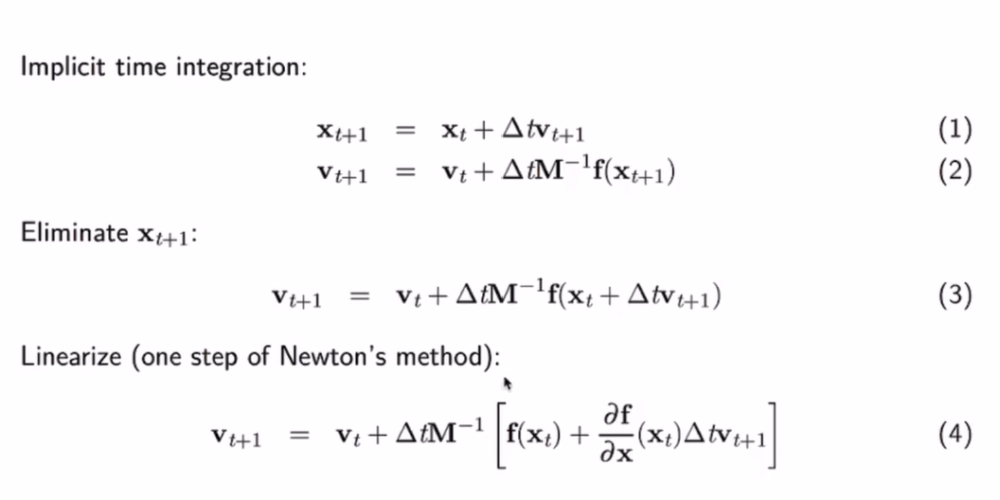
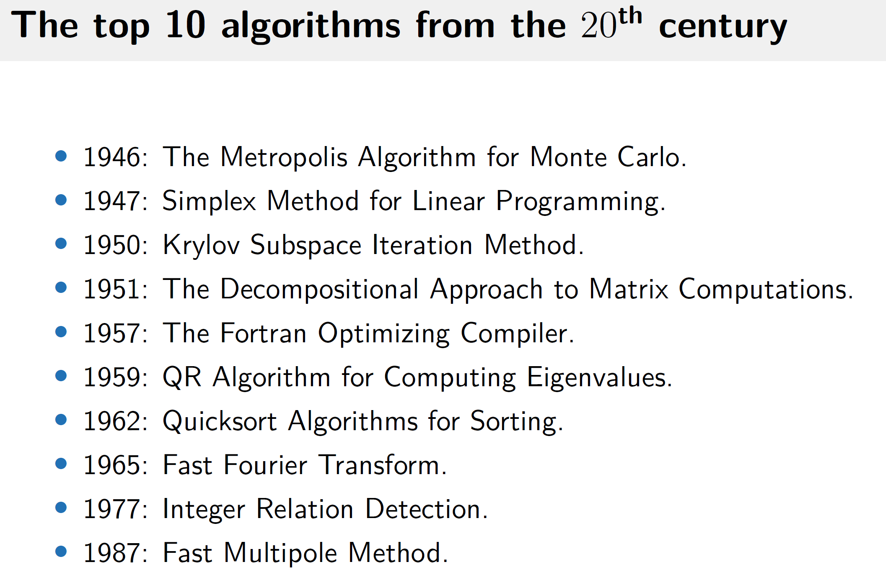

# Taichi {ignore=True}
<!-- @import "[TOC]" {cmd="toc" depthFrom=2 depthTo=5 orderedList=false} -->

<!-- code_chunk_output -->

- [Taichi {ignore=True}](#taichi-ignoretrue)
  - [Taichi language](#taichi-language)
  - [Taichi syntax basics](#taichi-syntax-basics)
    - [Data format](#data-format)
    - [Kernel and function](#kernel-and-function)
    - [For loops](#for-loops)
    - [Atomic operations](#atomic-operations)
    - [Scope](#scope)
    - [Phases of a Taichi program](#phases-of-a-taichi-program)
    - [Debug mode](#debug-mode)
  - [Lagrangian and Eulerian View](#lagrangian-and-eulerian-view)
    - [Lagrangian simulation approaches (1)](#lagrangian-simulation-approaches-1)
      - [Mass-spring system](#mass-spring-system)
      - [Time integration](#time-integration)
      - [Explicit v.s. implicit time integration](#explicit-vs-implicit-time-integration)
      - [Lagrangian fluid simulation: Smoothed particle hydrodynamics(SPH)](#lagrangian-fluid-simulation-smoothed-particle-hydrodynamicssph)
      - [Output mp4 and gif in taichi](#output-mp4-and-gif-in-taichi)
    - [Lagrangian simulation approaches (2)](#lagrangian-simulation-approaches-2)
      - [Basics of deformation, elasticity and FEM](#basics-of-deformation-elasticity-and-fem)
      - [Taichi programming language advanced features](#taichi-programming-language-advanced-features)
        - [ODOP](#odop)
        - [Metaprogramming](#metaprogramming)
        - [Differentiable programming](#differentiable-programming)
        - [Visualization](#visualization)
    - [Eulerian Fluid Simulation](#eulerian-fluid-simulation)
      - [Gradient](#gradient)
      - [Divergence](#divergence)
      - [Curl](#curl)
      - [Laplace operator $\Delta$](#laplace-operator-math-xmlnshttpwwww3org1998mathmathmlsemanticsmrowmi-mathvariantnormalδmimrowannotation-encodingapplicationx-texdeltaannotationsemanticsmathδ)
    - [1.2.4. Poisson's Equation and Fast Method](#124-poissons-equation-and-fast-method)
  - [Linear FEM and Topology optimization](#linear-fem-and-topology-optimization)
    - [FEM overview](#fem-overview)
    - [Discretizing Poisson's equation](#discretizing-poissons-equation)
      - [2D Poisson's equation](#2d-poissons-equation)
      - [Weak formulation](#weak-formulation)
      - [Getting rid of second-order terms](#getting-rid-of-second-order-terms)
      - [Discretization](#discretization)
    - [Discretizing linear elasticity](#discretizing-linear-elasticity)
      - [Linear elasticity FEM](#linear-elasticity-fem)
      - [Index notation](#index-notation)
      - [Discretize Cauchy momentum equation using FEM](#discretize-cauchy-momentum-equation-using-fem)
      - [Building the linear system](#building-the-linear-system)
    - [Topology optimization](#topology-optimization)

<!-- /code_chunk_output -->

## Taichi language


## Taichi syntax basics
The gene of Taichi is parallel computing.
### Data format
==Tensor== is a multidim array whose elements can be everything even matrices.
```python
import taichi as ti
ti.init()

a = ti.var(dt=ti.f32, shape=(42,63)) # a tensor of 42X63 scalars
b = ti.Vector(3, dt=ti.f32, shape=4) # a tensor of 4X3D vectors
c = ti.Matrix(2,2,dt=ti.f32,shape=(3,5)) # a tensor of 3X5 2X2 matrices
# ti.* defines the type of each element and the first part defines the size of each element
loss = ti.var(dt=ti.f32, shape=()) # this is a scalar defined in tensor form
loss[None]=3 # use this to assign value to a scalar in a tensor form
```

### Kernel and function
In Taichi, kernel is the computation function.
Kernels must be decorated with @ti.kernel. They can call functions but cannot be call other kernels.
Taichi functions can be called directly by Taichi kernels and other Taichi functions but not python. Only **one return** is supported up to now. They must be decorated with @ti.func.

Element-wise product *; marix product @.

### For loops
For loops in Taichi have 2 forms.
+ Range-for loops: Similar to Python. Will be parallelized when used at the outermost scope.
+ Struct-for loops: Iterates over (sparse) tensor elements.
For loops at the outermost scope in Taichi is **automatically parallelized**.

```py
ti.init(arch=ti.gpu)
n = 320
pixels = ti.var(dt=ti.f32, shape=(2*n, n))
@ti.kernel
def paint(t:ti.f32):
    for i,j in pixels:
        pixels[i,j] = i*3+j*4+t
```

### Atomic operations
Atomic operation is designed to deal with parallel computing. An atomic operation will go from start to finish without interruption of other threads.
In Taichi, augmented assignments (x[i]+=1)
```py
a[None] += 1 [right]
ti.atomic_add(a[None], 1) [right]
a[None] = a[None] + 1 [wrong]
```

### Scope
Taichi-scope: in @ti.kernel or @ti.func. Compiled in Taichi and run in parallel.

Python-scope: Compiled in Python.

### Phases of a Taichi program
+ Initialization: ti.init(...)
+ Tensor allocation: ti.var, ti.Vector, ti.Matrix
+ Computation (lauch kernels...)
+ Optional: restart the Taichi system (clear memory, destroy variables and kernels...) ti.reset()
  

> :grey_exclamation::eyes: After the first ti.kernel, no more tensor allocation is allowed.

```py
# fractal.py
import taichi as ti
ti.init(arch=ti.cpu)

n=320
pixels = ti.var(dt=ti.f32, shape=(2*n, n))

@ti.func
def complex_sqr(z):
    return ti.Vector([z[0]**2 - z[1]**2, z[1] * z[0] *2])

@ti.kernel
def paint(t: ti.f32):
    for i,j in pixels:
        c = ti.Vector([-0.8, ti.cos(t) * 0.2])
        z = ti.Vector([i/n - 1, j/n - 0.5]) * 2
        iterations = 0
        while z.norm() < 20 and iterations < 50:
            z = complex_sqr(z) + c
            iterations += 1
        pixels[i, j] = 1 - iterations * 0.02

gui = ti.GUI("Julia Set", res=(n * 2, n))
for i in range(1000000):
    paint(i * 0.03)
    gui.set_image(pixels)
    gui.show()
```

### Debug mode
debug = True (cpu only)
```py
ti.init(debug=True, arch=ti.cpu)
a = ti.var(dt=ti.f32, shape=(10))
b = ti.var(dt=ti.f32, shape=(10))
@ti.kernel
def shift():
    for i in range(10):
        a[i] = b[i+1]
# bound checker is only activated in debug mode to save time in normal mode.
shift()
```

## Lagrangian and Eulerian View

Lagrangian view: move with object.

Eulerian view: static.

### Lagrangian simulation approaches (1)

#### Mass-spring system
$$
\begin{aligned}
    \mathbf{f}{ij}&=-k(\|\mathbf{x}_i-\mathbf{x}_j\|_2-l_{ij})(\widehat{\mathbf{x}_i-\mathbf{x}_j})\quad(\rm Hooke's\,law)\\
    \mathbf{f}_i&=\sum_j^{j\neq i}\mathbf{f}_{ij}\\
    \frac{\partial \mathbf{v}_i}{\partial t}&=\frac{1}{m_i}\mathbf{f}_i\quad(\rm Newton's\,second\,law\,of\,motion)\\
    \frac{\partial \mathbf{x}_i}{\partial t}&=\mathbf{v}_i\\
\end{aligned}
$$

$\widehat{\mathbf{x}_i-\mathbf{x}_j}$: direction vector from particle $i$ to particle $j$ (unit vector).
$\widehat{\Box}$ means **normalization**.

**Implicit time integration:**

with taylor expansion


To solver this linear system, there are many methods like Jacobi iteration/Gauss-Seidel iteration or conjugate gradients(共轭梯度), etc.
**Unifying explict and implicit:**

**Solve faster**
For system with millions of mass points and springs,
+ Sparse matrices
+ Conjugate gradients
+ Preconditioning
+ Use position-based dynamics(PBD)
+ Also some faster approches like Fast mass-spring system solver("Fast simulation of mass-spring systems" in ACM Transactions)


#### Time integration
:one: Forward Euler (explicit)
$$
\begin{aligned}
\mathbf{v}_{t+1}&=\mathbf{v}_t+\Delta t\frac{\mathbf{f}_t}{m}\\
\mathbf{x}_{t+1}&=\mathbf{x}_t+\Delta t\mathbf{v}_t\\
\end{aligned}
$$

:two: Semi implicit Euler (aka. symplectic Euler, explicit)
$$
\begin{aligned}
\mathbf{v}_{t+1}&=\mathbf{v}_t+\Delta t\frac{\mathbf{f}_t}{m}\\
\mathbf{x}_{t+1}&=\mathbf{x}_t+\Delta t\mathbf{v}_{t+1}\\
\end{aligned}
$$

```py
# mass_spring.py

```

:three: Backward Euler (often with Newton's method, implicit)

#### Explicit v.s. implicit time integration
Explicit (forward Euler, symplectic Euler, RK, ...)
$$\Delta t \leq c\sqrt{\frac{m}{k}} \quad c\approx1$$ 

Implicit (backward Euler, middle-point, ...)

#### Lagrangian fluid simulation: Smoothed particle hydrodynamics(SPH)
**Courant-Friedrichs-Lewy(CFL) condition**
Another threshold

**Accelerating SPH: Neighborhood search**


#### Output mp4 and gif in taichi
ti.imwrite(img, filename)
ti video -f 24 or ti video -f 60
ti git -i input.mp4

Make sure ffmpeg installed!

### Lagrangian simulation approaches (2)

#### Basics of deformation, elasticity and FEM
**Deformation**
Deformation map $\phi$:$$\mathbf{x}_{\rm deformed}=\phi(\mathbf{x}_{\rm rest})$$

> This relates rest material position with deformed material position.

Deformation gradient $\mathbf{F}$:$$\mathbf{F}:=\frac{\partial\mathbf{x}_{\rm deformed}}{\partial\mathbf{x}_{\rm rest}}$$

> Deformation gradients are translational invariant.
> $\phi_1=\phi(\mathbf{x}_{\rm rest})$ and $\phi_2=\phi(\mathbf{x}_{\rm rest})+\rm c$ have the same $\mathbf{F}$.

Deform/rest volume ratio $J=\det(\mathbf{F})$

**Elasticity**
Hyperelasticity
whose stress-strain relationship is defined by **strain energy density function**.
$$\psi=\psi(\mathbf{F})$$

There are different measures of stress:
* THe First Piola-Kirchhoff stress tensor (PK1):$\mathbf{P}(\mathbf{F})=\frac{\partial\psi(\mathbf{F})}{\partial\mathbf{F}}$ (easy to compute but in rest space)
* Kirchhoff stress: $\boldsymbol{\tau}$
* Cauchy stress tensor: $\boldsymbol{\sigma}$ (symmetric)

Relationship: $\boldsymbol{\tau}=J\boldsymbol{\sigma}=\mathbf{P}\mathbf{F}^T\quad\mathbf{P}=J\boldsymbol{\sigma}\mathbf{F}^{-T}\quad \rm Traction\,\mathbf{t}=\boldsymbol{\sigma}^T\boldsymbol{n}$

* Young's modulus $E = \frac{\sigma}{\varepsilon}$
* Bulk modulus $K = -V\frac{dP}{dV}$
* Poisson's ratio $\nu\in[0,0.5)$
* Lame's first parameter $\mu$; Lame's second parameter $\lambda$ (aka. shear modulus $G$)

conversion formula:
$$K=\frac{E}{3(1-2\nu)}\qquad\lambda=\frac{E\nu}{(1+\nu)(1-2\nu)}\qquad\mu=\frac{E}{2(1+\nu)}$$

Popular hyperelastic material models (for each element)
* Neo-Hookean
  * $\psi(\mathbf{F})=\frac{\mu}{2}\sum_i[(\mathbf{F}^T\mathbf{F})_{ii}-1]-\mu\log(J)+\frac{\lambda}{2}\log^2(J)$
  * $\mathbf{P}(\mathbf{F})=\frac{\partial\psi(\mathbf{F})}{\partial\mathbf{F}}=2\mu(\mathbf{F}-\mathbf{R})+\lambda(J-1)J\mathbf{F}^{-T}$
* (Fixed) Corotated

**FEM**
Linear tetrahedral FEM
The deformation map $\phi$ is affine and thus deformation gradient $\mathbf{F}$ is **constant** within a single tetrahedral element:
$$\rm \mathbf{x}_{deformed}=\mathbf{F}\mathbf{x}_{rest}+\mathbf{b}$$

For every element $e$, its elastic potential energy
$$U(e)=\int_e\psi(\mathbf{F}(\mathbf{x}))\mathbf{x}=V_e\psi(\mathbf{F}_e)$$

For explicit scheme (semi-implicit)
$$\mathbf{v}_{t+1,i}=\mathbf{v}_{t,i}+\Delta t\frac{\mathbf{f}_{t,i}}{m_i}$$

$$\mathbf{x}_{t+1,i}=\mathbf{x}_{t,i}+\Delta t\mathbf{v}_{t+1,i}$$

$$\mathbf{f}_{t,i}\equiv-\frac{\partial U}{\partial \mathbf{x}_i}=-\sum_e\frac{\partial U(e)}{\partial \mathbf{x}_i}=-\sum_e V_e\frac{\partial\psi(\mathbf{F}_e)}{\partial\mathbf{F}_e}\frac{\partial \mathbf{F}_e}{\partial \mathbf{x}_i}=-\sum_eV_e\mathbf{P}(\mathbf{F}_e)\frac{\partial\mathbf{F}_e}{\partial\mathbf{x}_i}$$

#### Taichi programming language advanced features
##### ODOP
Data-oriented programming (DOP)
Objective data-oriented programming (ODOP)
+ 3 important decorators
  + Use @ti.data_oriented to decorate class.
  + Use @ti.kernel to decorate class members functions that are Taichi kernels.
  + Use @ti.func to decorate class members functions that are Taichi functions.

##### Metaprogramming
+ Allow to pass almost anything to Taichi kernels
+ Improve run-time performance by moving run-time costs to compile time
+ Achieve dimensionality independence
+ Simplify the development of Taichi standard library
```py
@ti.kernel
def copy(x: ti.template(), y: ti.template(), c: ti.f32):
    for i in x:
        y[i] = x[i] + c
```
Variable aliasing
##### Differentiable programming
reverse-mode automatic differentiation (AutoDiff)
$$f(x)\Rightarrow\frac{\partial f(x)}{\partial x}$$
##### Visualization


### Eulerian Fluid Simulation
#### Gradient
梯度
Hamilton operator $\nabla=(\frac{\partial}{\partial x_1},\frac{\partial}{\partial x_2},\dots,\frac{\partial}{\partial x_n})$
对于标量场$F(x_1,x_2,\dots,x_n)$,其梯度为矢量$\nabla F=(\frac{\partial F}{\partial x_1},\frac{\partial F}{\partial x_2},\dots,\frac{\partial F}{\partial x_n})$ 
对于矢量场$\boldsymbol{F}(x_1,x_2,\dots,x_n)=(F_1,F_2,\dots,F_n)$,
其梯度为二阶张量$\nabla\boldsymbol{F}_{ij}=\frac{\partial F_i}{\partial x_j}$ (Jacobi matrix)
对于标量场，其旋度为其梯度最大的方向，且梯度大小即为旋度模量。

#### Divergence
散度
“径向发散概念”
散度作用于矢量场得到标量
$\rm{div}\boldsymbol{F}=\nabla\cdot\boldsymbol{F}=\frac{\partial F_1}{\partial x_1}+\frac{\partial F_2}{\partial x_2}+\dots+\frac{\partial F_n}{\partial x_n}$
散度表示空间矢量场各点发散的强弱程度，物理意义为表征场的有源性，为场量在该点通量的体密度。
* $\rm{div}\boldsymbol{F}>0$表示该点为正源（发散源）；
* $\rm{div}\boldsymbol{F}<0$表示该点为负源（洞或汇）；
* $\rm{div}\boldsymbol{F}=0$表示该点无源。

可以用于理解高斯公式（高斯散度定理）
$\int_V\nabla\cdot\boldsymbol{F}\,dV=\int_S\boldsymbol{F}\cdot\,d\boldsymbol{S}$
即封闭区域表面通量之和等于体积域内旋度即通量体密度的体积积分。

通量为单位时间内通过某个曲面的量
散度即通量强度

#### Curl
旋度
“周向发散概念”
旋度作用于矢量场得到矢量
对于三维场量$\boldsymbol{F}=F_x\hat i+F_y\hat j+F_z\hat k$
其旋度可以表示为
$$\rm{curl}\boldsymbol{F}=\nabla\times\boldsymbol{F}=\begin{vmatrix}
    \hat i&\hat j&\hat k\\
    \frac{\partial}{\partial x}&\frac{\partial}{\partial y}&\frac{\partial}{\partial z}\\
    F_x&F_y&F_z\\
\end{vmatrix}$$

环流量是单位时间内环绕某个曲线的量
旋度是环流量强度
其方向符合右手定则

#### Laplace operator $\Delta$
拉普拉斯算子为梯度$\nabla$的散度$\nabla\cdot$
对于标量场函数$F$
$\Delta F=\nabla\cdot\nabla F=(\frac{\partial}{\partial x_1},\frac{\partial}{\partial x_2},\dots,\frac{\partial}{\partial x_n})\cdot(\frac{\partial F}{\partial x_1},\frac{\partial F}{\partial x_2},\dots,\frac{\partial F}{\partial x_n})=\sum_{i=1}^n\frac{\partial^2 F}{\partial x_i^2}$

advection
projection
Velocity-pressure formula(速度-压力型式N-S)
Velocity-vorticity formula(速度-旋度型式N-S):涡方法
$$\nabla \cdot (\nabla p)=\Delta p=\frac{\rho}{\Delta t}\nabla\cdot \boldsymbol{u}$$
Poisson's equation:
$$\Delta p=f$$
Laplace's equation:
$$\Delta p=0$$
Some simple explicit time integration schemes
* Forward Euler("RK1")
$$\rm{p-=dt*velocity(p)}$$
* Explicit Midpoint("RK2")
$$\rm{p\_mid=p-0.5*dt*velocity(p)}$$

$$\rm{p-=dt*velocity(p\_mid)}$$
* RK3
$$\begin{aligned}
    v1&=velocity(p)\\
    p1&=p-0.5*dt*v1\\
    v2&=velocity(p1)\\
    p2&=p-0.75*dt*v2\\
    v3&=velocity(p2)\\
    p&-=dt*(2/9*v1+1/3*v2+4/9*v3)
\end{aligned}$$


### 1.2.4. Poisson's Equation and Fast Method
快速多级展开算法(fast multipole method [fmm])
Tree code(Burnus hut)
multipole localpole
M2M Transform
M2L
L2L

math.nyu.edu/faulty/greengar/shortcourse_fmm.pdf

Boundary element method

Other fast summation methods:
* PPPM: Combining PDE form and summation forms
* Kernel Independent FMM


## Linear FEM and Topology optimization
### FEM overview
It belongs to the family of Galerkin methods.
- Convert strong (accurate at every point) to weak form
- Integrate by parts
- Use divergence theorem to simplify equations and enforce Neumann boundary conditions
- Discretization (build stiffness matrix and right-hand side)
- Solve the linear system

### Discretizing Poisson's equation
#### 2D Poisson's equation
$\nabla\cdot\nabla u=0$

Dirichlet boundary: displacement(第一类边界条件)
$u(x)=f(x)$
Neumann boundary: some kind of force(第二类边界条件)
$\nabla u(x)\cdot \boldsymbol{n}=g(x)$
#### Weak formulation
Arbitrary 2D test function $w(x)$:
$\nabla\cdot\nabla u=0 \Leftrightarrow \forall w,\iint_\Omega w(\nabla\cdot\nabla u)dA=0$
#### Getting rid of second-order terms
We want to get rid of $\nabla\cdot\nabla$ in $\nabla\cdot\nabla u=0$.
Integrate by parts:
$\nabla w\cdot\nabla u+w\nabla\cdot\nabla u=\nabla\cdot(w\nabla u)$
Since $\nabla\cdot\nabla u=0$, we have
$\nabla w\cdot\nabla u=\nabla\cdot(w\nabla u)$
Thus we have
$\nabla\cdot\nabla u=0 \Leftrightarrow \forall w, \iint_\Omega\nabla w\cdot \nabla u\, dA=\iint_\Omega\nabla\cdot(w\nabla u)dA$.
Apply divergence theorem to RHS(right-hand side)
$\iint_\Omega\nabla w\cdot \nabla u\, dA=\oint_{\partial \Omega} w\nabla u\cdot d\boldsymbol{n}$

#### Discretization
We represent $u(x)$ as 
$u(x)=\sum_j u_j \phi_j(x)$
Substitute this into the former equation
$\forall w, \iint_\Omega\nabla w\cdot \nabla (\sum_j u_j \phi_j)\, dA=\oint_{\partial \Omega} w\nabla u\cdot d\boldsymbol{n}$
We also use basis function $\phi_i$ as the test function $w$, and we have
$\forall i, \iint_\Omega\nabla \phi_i\cdot \nabla (\sum_j u_j \phi_j)\, dA=\oint_{\partial \Omega} \phi_i\nabla u\cdot d\boldsymbol{n}$
Extract $\sum_j u_j$ out of $\iint$
$\forall i, \sum_j(\iint_\Omega\nabla \phi_i\cdot \nabla \phi_j\, dA)u_j=\oint_{\partial \Omega} \phi_i\nabla u\cdot d\boldsymbol{n}$
In matrix form
$\boldsymbol{Ku=f}$

- Dirichlet BCs $u(x)=f(x), x\in \partial\Omega$:
set $u_i=f(x_i)$
- Neumann BCs $\nabla u(x)\cdot\boldsymbol{n}=g(x),x\in\partial\Omega$: 
Plug g into the RHS of the equation, which yields non-zeros in $\boldsymbol{f}$. (Some kind of force)
### Discretizing linear elasticity
#### Linear elasticity FEM
Cauchy momentum equation
$\frac{Dv}{Dt}=\frac{1}{\rho}\nabla\cdot\sigma+g$
v: velocity
$\rho$: density
$\sigma$: cauchy stress tensor
g: body force

For quasi-static state($v=0$), constant density, no gravity:
$\nabla\cdot\sigma=0$
#### Index notation
$\frac{Dv}{Dt}=\frac{1}{\rho}\nabla\cdot\sigma+g \Leftrightarrow \frac{Dv_\alpha}{Dt}=\frac{1}{\rho}\sum_\beta \sigma_{\alpha\beta,\beta}+g_\alpha$
#### Discretize Cauchy momentum equation using FEM
$\forall\alpha\forall i, \iint_\Omega\sum_\beta[\sigma(u(x))]_{\alpha\beta}\phi_{i\alpha}(x)dA=\oint_{\partial\Omega}\sum_\beta(\sigma_{\alpha\beta}\phi_{i\alpha}dn_\beta)$
#### Building the linear system
If $\sigma$ is a linear function of $u$,
$Ku=f$ can be explicitly expressed.

### Topology optimization
simp(Solid Isotropic Material with Penalization) 
oc(Optimility Criterion)
minimize deformation energy

The most common topology optimization problem is minimal compliance:
$$
\begin{aligned}
  \min\quad L(\rho)&=u^TK(\rho)u\\
  s.t. \quad K(\rho)u&=f\\
  \sum_e \rho_e&\leq cV\\
  \rho_e&\in [\rho_{\min},1]\\
\end{aligned}
$$

$L$: measure of deformation energy, or the loss function
$c$: volume fraction ($c \in (0,1]$)
$\rho_e$: material occupancy of cell $e$ (0=empty, 1=filled, $\rho$ is usually $10^{-2}$ or $10^{-3}$.)
$V$: total volume


