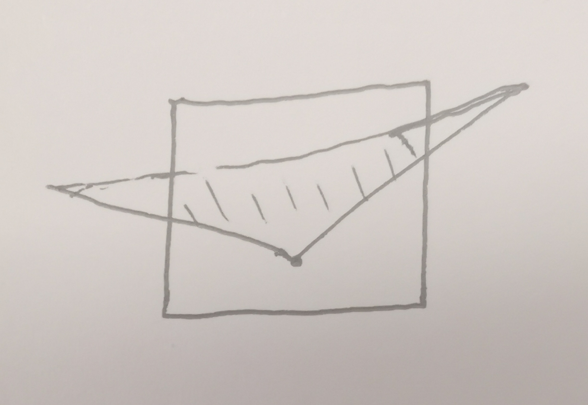
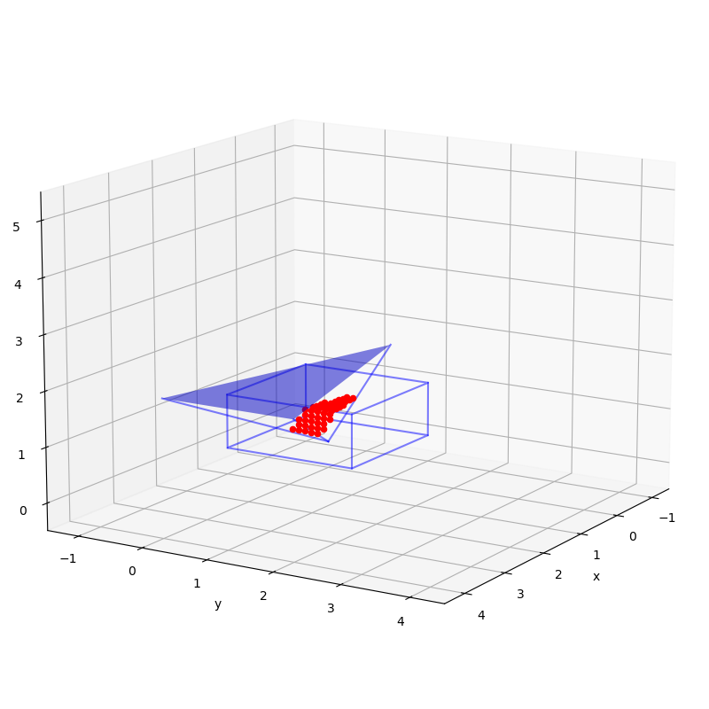

## 总体思路
三角形相对于原点，先假定各个面均无限大，计算其在5个面上各自的三个投影点，筛选出真实存在投影的面，利用三角形光栅化方法计算其覆盖的点，利用边界筛选出真实的投影点，组合计算辐射角系数。

该方法光栅化筛选范围很大，效率较低，如何优化？

## 投影点计算
假定各个面均无限大
+ 计算在各个面的投影点 （线面交点）
  空间中平面表示为$(\boldsymbol{p}-\boldsymbol{p_0})\cdot\boldsymbol{n}=0$
  其中$\boldsymbol{p}$为平面内任意一点，$\boldsymbol{p_0}$为平面内某已知点，$\boldsymbol{n}$为平面法向量。
  空间内直线表示为$\boldsymbol{p}=\boldsymbol{l_0}+\boldsymbol{l}t$
  其中$\boldsymbol{p}$为直线上任意一点，$\boldsymbol{l_0}$为直线所经过的已知点，$\boldsymbol{l}$为直线的方向向量，$t$为任意实数。
  联立两方程可得
  $$t = \frac{(\boldsymbol{p_0}-\boldsymbol{l_0})\cdot\boldsymbol{n}}{\boldsymbol{l}\cdot\boldsymbol{n}}$$

  若$\boldsymbol{l}\cdot\boldsymbol{n}=0$，则直线与平面平行，此时若$(\boldsymbol{p_0}-\boldsymbol{l_0})\cdot\boldsymbol{n}=0$，则直线在平面内，否则直线与平面没有交点。
  若$\boldsymbol{l}\cdot\boldsymbol{n}\neq0$，则直线与平面有唯一交点，表示为
  $$\boldsymbol{l_0}+\boldsymbol{l}t$$

+ 计算合法的投影面
  三角形各点与三角形连线，分别计算三条线与各个面的交点。平行于面即与面无交点或者交点z坐标为负值的情况对应的点为非法点，此时将该点向合法点方向移动一定距离再投影即可得合法交点。（移动投影所得交点一定要保证在矩形面外部以利于下一步光栅化）
  合法点为存在投影点且投影点z坐标非负的点。（即使三个交点均不在矩形面内也可能存在投影区域）。
  在做平移投影时，所得新投影点需要在矩形平面外且z坐标非负。（可能需要迭代，z坐标为负时需要增大alpha，在矩形内时需要减小alpha）
  为了避免投影三角形穿过矩形两条对边而导致包围区域不完全的情况（如图），对于侧面，应保证投影点z值大于1，对于顶面，alpha应取较小值（0.1）以规避该情况。对于投影面较小的情况无需此项考虑。


  分为无非法点，1个非法点，2个非法点，3个非法点4种情况。
  + 无非法点
    获得3个合法交点，直接进行光栅化。
  + 1个非法点
    该非法点向2个合法点方向分别平移求投影，得到4个交点
  + 2个非法点
    2个非法点均平移投影，得到3个交点
  + 3个非法点
    不计算投影
  
  存储各个交点坐标。（2个合法点对应4个交点，1个和3个均对应3个交点，0个合法点不存在投影）

## 光栅化
利用包围盒与判定点在三角形内方法筛选点，同时利用边界去掉多余点。
+ 包围盒计算
  需要求两个矩形的交集
  需要将坐标值转换为对应index（即求出给定坐标点位于哪个网格内）（可否优化减小包围盒面积？）
+ 光栅化
  遍历包围盒内所有点，根据外积的符号一致性判断点是否在投影区域内

$\overrightarrow{AB}\times\overrightarrow{AP}\qquad\overrightarrow{BC}\times\overrightarrow{BP}\qquad\overrightarrow{CA}\times\overrightarrow{CP}$
如果以上三项同号，说明点P同时在三条边的左侧/右侧，即点P在$\Delta ABC$内部，否则即在外部。该方法同样适用于凸多边形。
最终程序为$projection.py$,效果图为


```py{cmd="C:\\Users\\LittleFish\\Anaconda3\\envs\\py37\\python.exe"}
# projection.py
import numpy as np
import matplotlib.pyplot as plt
from mpl_toolkits.mplot3d import Axes3D
import os

def getNVP(key):
    # return normal vector and a point on the plane
    # in this case they are the same
    if key == '1':
        nvp = np.array([0,0,1])
    elif key == '2':
        nvp = np.array([1,0,0])
    elif key == '3':
        nvp = np.array([0,1,0])
    elif key == '4':
        nvp = np.array([-1,0,0])
    elif key == '5':
        nvp = np.array([0,-1,0])
    else:
        raise Exception("No such key in getNVP!")
    return nvp

def checkLegalZ(p):
    # check if z coordinate of p is positive
    legal = False
    if p[2] >= 0:
        legal = True
    return legal

def checkLegal(key, p):
    # check if the interaction point is legal
    x = p[0]
    y = p[1]
    z = p[2]
    legal = False
    if key == '1':
        if x <= 1 and x >= -1 and y <= 1 and y >= -1 and z == 1:
            legal = True
    else:
        if z <= 1:
            legal = True
    '''
    elif key == '2':
        if x == 1 and y <= 1 and y >= -1 and z >= 0 and z <= 1:
            legal = True
    elif key == '3':
        if x <= 1 and x >= -1 and y == 1 and z >= 0 and z <= 1:
            legal = True
    elif key == '4':
        if x == -1 and y <= 1 and y >= -1 and z >= 0 and z <= 1:
            legal = True
    elif key == '5':
        if x <= 1 and x >= -1 and y == -1 and z >= 0 and z <= 1:
            legal = True
    else:
        raise Exception("No such key in checkLegal!")
    '''
    return legal

def getInter(key, p):
    # get intersection between line from origin to point p and key plane
    # legal => 1; => 0 (op is parallel to key plane); => -1 (op's inter has negative z)
    legal = 1
    inter = np.zeros(3)
    
    l = p
    n = getNVP(key)
    p0 = n
    
    denom = l @ n
    if denom == 0:
        legal = 0
    else:
        t = (p0 @ n) / denom
        inter = t * l
        if not checkLegalZ(inter):
            legal = -1
    return inter, legal
    
def getAlterInter(key, illegalP, legalP):
    # move illegal point along the direction of the legal point
    # and compute the intersection
    # alpha cannot be large to avoid erros in z plane.
    alpha = 0.1
    a0 = 0
    a1 = 1
    iter = 10
    num = 0
    direction = legalP - illegalP
    while num < iter:
        num += 1
        newP = illegalP + alpha * direction
        # should ensure new inter is outside the rectangle
        # if inside, a smaller value should be adopted rather than 0.1
        inter, legal = getInter(key, newP)
        if legal == 1:
            if checkLegal(key, inter):
                # inter is inside key rectangle
                a1 = alpha
                alpha = (alpha + a0) / 2
            else:
                break
        else:
            # legal == -1/0
            a0 = alpha
            alpha = (alpha + a1) / 2

    if num == iter:
        raise Exception("Max iteration reached!")
    return inter

def getFinalInters(key, test, inters, legals):
    # get corrected inters
    # sm: num of legal inters
    # flags: record which inter is the altered one
    flags = np.zeros(3)
    sm = 0
    for i in range(3):
        if legals[i] == 1:
            sm += 1
    # direction corresponding to each inter
    # can be optimized (eg. for 1 legal point, only 2 points and dirs are needed)
    if sm == 0:
        # need to change!! (for cases with 3 z<0 points) + flag
        print("No projection detected!")
        # ensure newinters have no intersections with rectangles!
        newinters = np.ones((3,3)) * (-10)
    elif sm == 1:
        newinters = np.zeros((3,3))
        for i in range(3):
            if legals[i] < 1:
                for j in range(2):
                    k = (i+j+1)%3
                    if legals[k] == 1:
                        legalP = test[k]
                        illegalP = test[i]
                        altInter = getAlterInter(key, illegalP, legalP)
                        newinters[i] = altInter
                        flags[i] = 1
            else:
                newinters[i] = inters[i]
    elif sm == 2:
        newinters = np.zeros((4,3))
        flags = np.zeros(4)
        for i in range(3):
            j = 0
            for i in range(3):
                if legals[i] < 1:
                    illegalP = test[i]
                    legalP = test[(i+2)%3]
                    altInter = getAlterInter(key, illegalP, legalP)
                    newinters[j] = altInter
                    flags[j] = 1
                    j += 1
                    
                    legalP = test[(i+1)%3]
                    altInter = getAlterInter(key, illegalP, legalP)
                    newinters[j] = altInter
                    flags[j] = 1
                    j += 1
                else: 
                    newinters[j] = inters[i]
                    j += 1
    elif sm == 3:
        newinters = inters
    else:
        raise Exception("Sum of legals out of bound!")
    return newinters, flags

def getInters(key, test):
    # get insections between triangle test and key plane
    # inters is in shape (3,3) or (4,3)
    inters = np.zeros((3,3))
    legals = np.zeros(3)
    for i in range(3):
        inter, legal = getInter(key, test[i])
        inters[i] = inter
        legals[i] = legal
        
    inters, flags = getFinalInters(key, test, inters, legals)
    return inters, flags

def getInterRec(rec1, rec2):
    # get the interaction region between two rectangles
    # each rectangle is in form rec1 = array[[xmin, ymin], [xmax, ymax]]
    exist = True
    recInter = np.zeros((2,2))
    startX = max(rec1[0][0], rec2[0][0])
    endX = min(rec1[1][0], rec2[1][0])
    startY = max(rec1[0][1], rec2[0][1])
    endY = min(rec1[1][1], rec2[1][1])
    if startX >= endX or startY >= endY:
        exist = False
    else:
        recInter[0,0] = startX
        recInter[0,1] = startY
        recInter[1,0] = endX
        recInter[1,1] = endY
    return recInter, exist

def getInterRegion(key, inters):
    # get intersection region between inters and the key plane
    # return recInter is in shape (2,2) => 2D
    p1 = np.min(inters, axis=0).reshape(1,-1)
    p2 = np.max(inters, axis=0).reshape(1,-1)
    rec = np.concatenate((p1, p2), axis=0)
    rec2 = g2l(key, rec)
    
    if key == '1':
        rec1 = np.array([[-1,-1],[1,1]])
    elif key == '2':
        rec1 = np.array([[-1,0],[1,1]])
    elif key == '3':
        rec1 = np.array([[-1,0],[1,1]])
    elif key == '4':
        rec1 = np.array([[-1,0],[1,1]])
    elif key == '5':
        rec1 = np.array([[-1,0],[1,1]])
    else:
        raise Exception("No such key in getInterRegion")
    recInter, exist = getInterRec(rec1, rec2)
    return recInter, exist

def g2l(key, p):
    # from global coordinates to local
    # 3D => 2D
    # p is in shape (-1,3); pl is in shape (-1,2)
    p = p.reshape(-1,3)
    if key == '1':
        pl = p[:, (0,1)]
    elif key == '2':
        pl = p[:, (1,2)]
    elif key == '3':
        pl = p[:, (0,2)]
    elif key == '4':
        pl = p[:, (1,2)]
    elif key == '5':
        pl = p[:, (0,2)]
    else:
        raise Exception("No such key in g2l!")
    return pl

def l2g(key, p):
    # from local coordinates to global
    # 2D => 3D
    # p is in shape (-1,2); pg is in shape (-1,3)
    p = p.reshape(-1,2)
    m = p.shape[0]
    
    if key == '1':
        pg = np.concatenate((p[:,0].reshape(-1,1),p[:,1].reshape(-1,1),(1*np.ones(m)).reshape(-1,1)), axis=1)
    elif key == '2':
        pg = np.concatenate(((1*np.ones(m)).reshape(-1,1),p[:,0].reshape(-1,1),p[:,1].reshape(-1,1)), axis=1)
    elif key == '3':
        pg = np.concatenate((p[:,0].reshape(-1,1),(1*np.ones(m)).reshape(-1,1),p[:,1].reshape(-1,1)), axis=1)
    elif key == '4':
        pg = np.concatenate(((-1*np.ones(m)).reshape(-1,1),p[:,0].reshape(-1,1),p[:,1].reshape(-1,1)), axis=1)
    elif key == '5':
        pg = np.concatenate((p[:,0].reshape(-1,1),(-1*np.ones(m)).reshape(-1,1),p[:,1].reshape(-1,1)), axis=1)
    else:
        raise Exception("No such key in l2g!")
    return pg

def coo2mesh(key, p):
    # from local coordinates to mesh indexes
    # p is a single point in shape (,2)
    index = np.zeros(2)
    if key == '1':
        index[1] = min(int((p[0] + 1) * n), 2*n-1)
        index[0] = min(int((p[1] + 1) * n), 2*n-1)
    else:
        index[1] = min(int((p[0] + 1) * n), 2*n-1)
        index[0] = min(int(p[1] * n), n-1)
    return index

def mesh2coo(key, index):
    # from mesh indexes to local coordinates of the center of this grid
    # index is indexes of a point in shape (,2)
    p = np.zeros(2)
    if key == '1':
        p[0] = -1 + 1/(2*n) + index[1] / n
        p[1] = -1 + 1/(2*n) + index[0] / n
    else:
        p[0] = -1 + 1/(2*n) + index[1] / n
        p[1] = 1/(2*n) + index[0] / n
    return p

def getDir(inters):
    # get the direction of each edge
    # inters is in shape (3.3) or (4,3) which forms a convex polygon
    m, n = inters.shape
    dirs = np.zeros((m, n))
    for i in range(m):
        dirs[i] = inters[(i+1) % m] - inters[i]
    return dirs

def checkIn(p, inters, dirs):
    # check if point p inside the polygon
    isIn = False
    m = inters.shape[0]
    values = []
    for i in range(m):
        d1 = p - inters[i]
        d2 = dirs[i]
        # c has 2 zeros and a value
        c = np.cross(d1, d2)
        values.append(np.sum(c))
    if min(values) >= 0 or max(values) <= 0:
        isIn = True
    return isIn


n = 10
mesh = {'1': np.zeros((2*n,2*n)),
        '2': np.zeros((n,2*n)),
        '3': np.zeros((n,2*n)),
        '4': np.zeros((n,2*n)),
        '5': np.zeros((n,2*n))}

#test = np.array([[0,1,2],[4,0,2],[4,4,2]])
#test = np.array([[0,1,2],[0,0,2],[4,4,2]])
#test = np.array([[0,1,2],[0,0,2],[10,2,2]])
#test = np.array([[10,0,2],[-10,-10,2],[-10,10,2]])/15
#test = np.array([[-2,1,2],[4,0,2],[4,4,2]])
test = np.array([[0,1,2],[4,0,2],[4,2,2]])

for key in mesh.keys():
    print(key)
    inters, flags = getInters(key, test)
    
    dirs = getDir(inters)
    #print(inters)
    #print(dirs)

    recInter, exist = getInterRegion(key, inters)
    #print(recInter, exist)
    if exist:
        minIndex = coo2mesh(key, recInter[0])
        maxIndex = coo2mesh(key, recInter[1])
        #print(minIndex, maxIndex)
        for i in np.arange(minIndex[0], maxIndex[0]+1):
            for j in np.arange(minIndex[1], maxIndex[1]+1):
                index = np.array([i,j])
                p = mesh2coo(key, index)
                p = l2g(key, p)
                if checkIn(p, inters, dirs):
                    #print(i,j)
                    mesh[key][int(i),int(j)] = 1
                    #print(p)
        print(np.sum(mesh[key]))


def draw(x, y, z, dx, dy, dz, tri, mesh, color='blue'):
    fig = plt.figure(figsize=(8,8))
    ax = Axes3D(fig)
    xx = [x, x, x+dx, x+dx, x]
    yy = [y, y+dy, y+dy, y, y]
    kwargs = {'alpha': 0.5, 'color': color}
    # draw lines to form face
    ax.plot3D(xx, yy, [z]*5, **kwargs)
    ax.plot3D(xx, yy, [z+dz]*5, **kwargs)
    ax.plot3D([x, x], [y, y], [z, z+dz], **kwargs)
    ax.plot3D([x, x], [y+dy, y+dy], [z, z+dz], **kwargs)
    ax.plot3D([x+dx, x+dx], [y+dy, y+dy], [z, z+dz], **kwargs)
    ax.plot3D([x+dx, x+dx], [y, y], [z, z+dz], **kwargs)
    
    tri = tri.T
    Xt = tri[0]
    Yt = tri[1]
    Zt = tri[2]
    ax.plot_trisurf(Xt,Yt,Zt, **kwargs)
    
    for i in range(3):
        X = [0, tri[0,i]]
        Y = [0, tri[1,i]]
        Z = [0, tri[2,i]]
        ax.plot3D(X,Y,Z, **kwargs)
    
    for key in mesh.keys():
        meshes = mesh[key]
        m, n = meshes.shape
        for i in range(m):
            for j in range(n):
                index = np.array([i,j])
                p = mesh2coo(key, index)
                p = l2g(key, p)
                if meshes[i,j]:
                    ax.scatter(p[0,0],p[0,1],p[0,2],c='r')
                else:
                    pass
                    #ax.scatter(p[0,0],p[0,1],p[0,2],c='k')
    #ax.set_aspect('equal')
    xmin = min(-1, min(Xt))
    xmax = max(1, max(Xt))
    ymin = min(-1, min(Yt))
    ymax = max(1, max(Yt))
    zmin = min(0, min(Zt))
    zmax = max(1, max(Zt))
    xl = xmax - xmin
    yl = ymax - ymin
    zl = zmax - zmin
    l = max(xl, yl, zl)
    ax.set_xlim(xmin-0.5, xmin+l+0.5)
    ax.set_ylim(ymin-0.5, ymin+l+0.5)
    ax.set_zlim(zmin-0.5, zmin+l+0.5)
    ax.set_xlabel('x')
    ax.set_ylabel('y')
    ax.set_zlabel('z')
    plt.show()

draw(-1,-1,0,2,2,1,test,mesh)
```

